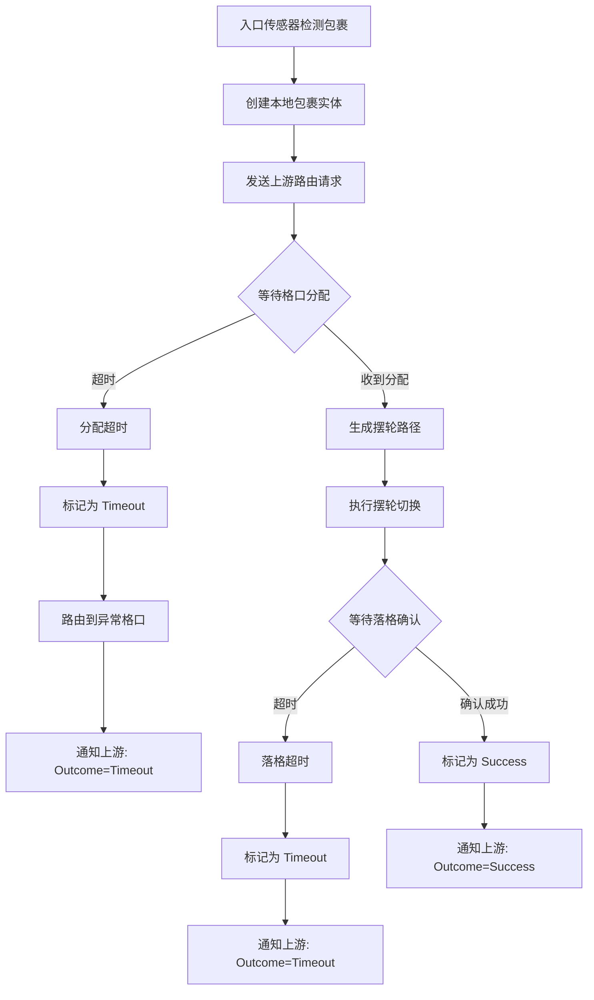
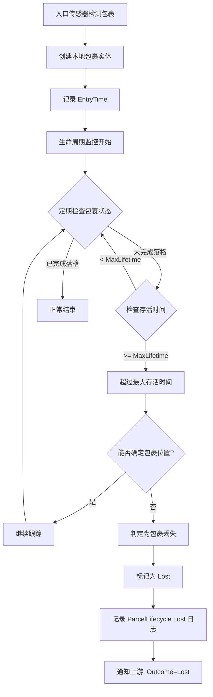

# ZakYip.WheelDiverterSorter

[](https://github.com/Hisoka6602/ZakYip.WheelDiverterSorter/actions/workflows/dotnet.yml)
[](https://codecov.io/gh/Hisoka6602/ZakYip.WheelDiverterSorter)

直线摆轮分拣系统 - 基于方向控制的包裹自动分拣解决方案

## 系统概述

基于直线摆轮（Wheel Diverter）的包裹自动分拣系统。包裹通过传感器检测进入系统，在输送线上单向移动，经过配置的摆轮节点时，根据转向方向（左/右/直行）分流到目标格口。

### 系统拓扑

```
                    ┌─────────┐
                    │  格口B   │ (摆轮D1右转)
                    └────▲────┘
                         │
入口传感器 ──▶ [摆轮D1] ──▶ [摆轮D2] ──▶ [摆轮D3] ──▶ 末端(异常口999)
    │              │           │           │
    ▼              ▼           ▼           ▼
 创建包裹     ┌─────────┐ ┌─────────┐ ┌─────────┐
             │  格口A   │ │  格口C   │ │  格口E   │
             │(D1左转)  │ │(D2左转)  │ │(D3左转)  │
             └─────────┘ └─────────┘ └─────────┘
                    ┌─────────┐ ┌─────────┐
                    │  格口D   │ │  格口F   │
                    │(D2右转)  │ │(D3右转)  │
                    └─────────┘ └─────────┘
```

**说明**：
- 每个摆轮前有感应传感器（FrontSensor）检测包裹到达
- 摆轮支持三个方向：左转、右转、直行
- 包裹沿输送线单向移动，无法后退
- 未分拣的包裹最终到达末端异常格口

### 分拣流程

```
┌──────────────┐     ┌──────────────┐     ┌──────────────┐
│ 1. 包裹检测   │────▶│ 2. 格口分配   │────▶│ 3. 路径生成   │
│ 入口传感器触发 │     │ 上游/固定/轮询 │     │ 查询拓扑配置  │
│ 创建包裹实体  │     │              │     │              │
└──────────────┘     └──────────────┘     └──────────────┘
                                                │
                                                ▼
┌──────────────┐     ┌──────────────┐     ┌──────────────┐
│ 6. 完成分拣   │◀────│ 5. 确认落格   │◀────│ 4. 路径执行   │
│ 记录结果     │     │ 格口传感器确认 │     │ 控制摆轮转向  │
└──────────────┘     └──────────────┘     └──────────────┘
```

**异常处理**：任意步骤失败（超时/设备异常/连接失败）→ 路由到异常格口

### 包裹超时与丢失判定

#### 包裹超时如何判断

系统基于输送线长度和速度自动计算超时时间：

1. **分配超时**（AssignmentTimeout）：
   - 条件：包裹检测后超过动态计算的超时时间未收到格口分配
   - 计算：`超时时间 = 入口到首个决策点距离 / 线速 × SafetyFactor`
   - 动作：标记为 `Timeout` 状态，路由到异常格口，通知上游（Outcome=Timeout）

2. **落格超时**（SortingTimeout）：
   - 条件：格口分配后超过理论通过时间未完成落格确认
   - 计算：`超时时间 = 路径总长度 / 线速`（根据生成的路径自动计算）
   - 动作：标记为 `Timeout` 状态，路由到异常格口，通知上游（Outcome=Timeout）

```json
{
  "ChuteAssignmentTimeout": {
    "SafetyFactor": 0.9,
    "FallbackTimeoutSeconds": 5,
    "LostDetectionSafetyFactor": 1.5
  }
}
```

#### 包裹丢失如何判断

**丢失判定**（由程序根据输送线参数自动计算）：
- 条件：从首次检测时间起，超过 `理论通过时间 × LostDetectionSafetyFactor` 仍未完成落格，且无法确定位置
- 计算：`最大存活时间 = 输送线总长度 / 线速 × LostDetectionSafetyFactor`
- 动作：
  1. 标记为 `Lost` 状态
  2. **从缓存中清除包裹记录**（避免队列错分）
  3. 通知上游（Outcome=Lost, ActualChuteId=0）

> **重要区别**：
> - **超时**：包裹仍在输送线上，可以导向异常口
> - **丢失**：包裹已不在输送线上，无法导向异常口，必须从缓存清除

#### 包裹超时处理流程图



#### 包裹丢失处理流程图



### 核心特点

- ✅ 方向控制模式（左/右/直行）
- ✅ 传感器驱动，实时跟踪包裹位置
- ✅ LiteDB 动态配置，支持运行时热更新
- ✅ 多协议通信（TCP/SignalR/MQTT）
- ✅ 完整异常处理，自动路由到异常格口
- ✅ 三种分拣模式（正式/指定落格/循环落格）
- ✅ 多厂商硬件支持（雷赛/西门子/摩迪/书迪鸟/仿真）

### 系统架构

```
┌─────────────────────────────────────────────────────────────────────────────┐
│                              Host (ASP.NET Core)                             │
│  ┌─────────────┐  ┌─────────────┐  ┌─────────────┐  ┌─────────────────────┐ │
│  │ Controllers │  │ StateMachine│  │   Workers   │  │    Swagger/API      │ │
│  └──────┬──────┘  └──────┬──────┘  └──────┬──────┘  └─────────────────────┘ │
└─────────┼────────────────┼────────────────┼─────────────────────────────────┘
          │                │                │
          ▼                ▼                ▼
┌─────────────────────────────────────────────────────────────────────────────┐
│                         Application (DI 聚合层)                              │
│  ┌────────────────┐  ┌────────────────┐  ┌────────────────┐                 │
│  │ Config Service │  │ Sorting Service│  │ Health Service │                 │
│  └────────────────┘  └────────────────┘  └────────────────┘                 │
└───────────────────────────────┬─────────────────────────────────────────────┘
                                │
        ┌───────────────────────┼───────────────────────┐
        │                       │                       │
        ▼                       ▼                       ▼
┌───────────────┐      ┌───────────────┐      ┌───────────────────────────────┐
│   Execution   │      │    Ingress    │      │        Infrastructure         │
│ ┌───────────┐ │      │ ┌───────────┐ │      │  ┌─────────────────────────┐  │
│ │Orchestrator│ │      │ │  Sensors  │ │      │  │    Communication        │  │
│ │  Pipeline │ │      │ │ Detection │ │      │  │  (TCP/SignalR/MQTT)     │  │
│ └───────────┘ │      │ └───────────┘ │      │  └─────────────────────────┘  │
└───────┬───────┘      └───────────────┘      │  ┌─────────────────────────┐  │
        │                                      │  │ Config.Persistence     │  │
        ▼                                      │  │     (LiteDB)           │  │
┌───────────────┐      ┌───────────────┐      │  └─────────────────────────┘  │
│    Drivers    │      │  Simulation   │      └───────────────────────────────┘
│ ┌───────────┐ │      │ ┌───────────┐ │
│ │ Leadshine │ │      │ │ Scenarios │ │
│ │ ShuDiNiao │ │      │ │  Runner   │ │
│ │ Siemens   │ │      │ └───────────┘ │
│ │ Simulated │ │      └───────────────┘
│ └───────────┘ │
└───────────────┘
        │
        ▼
┌───────────────────────────────────────────────────────────────────────────┐
│                            Core (领域模型)                                 │
│  ┌──────────────┐  ┌──────────────┐  ┌──────────────┐  ┌──────────────┐   │
│  │   Hardware   │  │   LineModel  │  │   Sorting    │  │  Abstractions│   │
│  │  (HAL 抽象)  │  │ (配置/拓扑)  │  │  (分拣逻辑)  │  │  (上游接口)  │   │
│  └──────────────┘  └──────────────┘  └──────────────┘  └──────────────┘   │
└───────────────────────────────────────────────────────────────────────────┘
```

**依赖方向**：Host → Application → (Execution/Drivers/Ingress/Infrastructure/Simulation) → Core

## 项目结构

```
src/
├── Host/               # ASP.NET Core 宿主应用（API、后台服务、状态机）
├── Application/        # 应用服务层，DI 聚合入口
├── Core/               # 核心领域模型、配置仓储接口、HAL 抽象
├── Execution/          # 分拣执行管线、路径执行、SortingOrchestrator
├── Drivers/            # 硬件驱动（雷赛/西门子/摩迪/书迪鸟/仿真）
├── Ingress/            # 传感器管理、包裹检测
├── Infrastructure/     # 基础设施层
│   ├── Communication/              # 上游通信（TCP/SignalR/MQTT）
│   └── Configuration.Persistence/  # LiteDB 配置持久化
├── Observability/      # 监控指标、日志、告警、安全执行服务
├── Simulation/         # 仿真服务库
│   ├── Simulation/     # 仿真服务库（Library）
│   ├── Simulation.Cli/ # 仿真命令行入口（Exe）
│   └── Simulation.Scenarios/  # 仿真场景定义
└── Analyzers/          # Roslyn 代码分析器

tests/                  # 测试项目
├── Core.Tests/         # 核心层单元测试
├── Execution.Tests/    # 执行层单元测试
├── Drivers.Tests/      # 驱动层单元测试
├── Ingress.Tests/      # 入口层单元测试
├── Communication.Tests/# 通信层单元测试
├── Observability.Tests/# 可观测性层单元测试
├── Host.Application.Tests/  # 应用服务单元测试
├── Host.IntegrationTests/   # 主机集成测试
├── E2ETests/           # 端到端测试
├── ArchTests/          # 架构合规性测试
├── TechnicalDebtComplianceTests/  # 技术债合规性测试
└── Benchmarks/         # 性能基准测试

tools/                  # 工具项目
├── Reporting/          # 仿真报告分析工具
├── SafeExecutionStats/ # SafeExecution 统计工具
└── Profiling/          # 性能剖析脚本

monitoring/             # Prometheus/Grafana 配置
```

## 快速开始

### 运行项目

```bash
cd src/Host/ZakYip.WheelDiverterSorter.Host
dotnet run
```

默认监听端口：5000（HTTP），访问 Swagger UI：http://localhost:5000/swagger

### 运行测试

```bash
dotnet test
```

### 生产环境部署

```bash
dotnet publish src/Host/ZakYip.WheelDiverterSorter.Host -c Release -o out/host
cd out/host
DOTNET_ENVIRONMENT=Production ASPNETCORE_URLS=http://0.0.0.0:5000 ./ZakYip.WheelDiverterSorter.Host
```

## API 概览

### 系统与健康检查

| 端点 | 方法 | 说明 |
|------|------|------|
| `/api/system/status` | GET | 系统状态查询（支持高并发） |
| `/api/system/restart` | POST | 系统重启 |
| `/health/ready` | GET | 就绪状态检查（Kubernetes readiness probe） |
| `/health/prerun` | GET | 运行前健康检查 |
| `/health/drivers` | GET | 驱动健康状态检查 |

### 配置管理

| 端点 | 方法 | 说明 |
|------|------|------|
| `/api/config/system` | GET/PUT | 系统配置（分拣模式、异常格口等） |
| `/api/config/system/sorting-mode` | GET/PUT | 分拣模式配置 |
| `/api/config/communication` | GET/PUT | 上游通信配置 |
| `/api/config/chute-path-topology` | GET/PUT | 格口路径拓扑配置 |
| `/api/config/chute-assignment-timeout` | GET/PUT | 格口分配超时配置 |
| `/api/config/io-linkage` | GET/PUT | IO 联动配置 |
| `/api/config/panel` | GET/PUT | 面板配置 |
| `/api/config/logging` | GET/PUT | 日志配置 |
| `/api/config/simulation` | GET/PUT | 仿真配置 |

### 硬件配置

| 端点 | 方法 | 说明 |
|------|------|------|
| `/api/hardware/leadshine` | GET/PUT | 雷赛 IO 卡配置 |
| `/api/hardware/leadshine/sensors` | GET/PUT | 雷赛传感器配置 |
| `/api/hardware/shudiniao` | GET/PUT | 书迪鸟摆轮配置 |

### 业务操作

| 端点 | 方法 | 说明 |
|------|------|------|
| `/api/diverts/change-chute` | POST | 改口操作 |
| `/api/alarms` | GET | 获取告警列表 |
| `/api/alarms/acknowledge` | POST | 确认告警 |
| `/api/policy/exception-routing` | GET/PUT | 异常路由策略 |
| `/api/policy/overload` | GET/PUT | 超载策略 |

### 通信与仿真

| 端点 | 方法 | 说明 |
|------|------|------|
| `/api/communication/status` | GET | 通信状态查询 |
| `/api/communication/test` | POST | 通信测试 |
| `/api/simulation/run-scenario-e` | POST | 运行仿真场景 |
| `/api/simulation/status` | GET | 仿真状态查询 |
| `/api/simulation/panel/*` | POST | 面板仿真操作 |

## 分拣模式

| 模式 | 说明 | 使用场景 |
|------|------|----------|
| Formal | 与上游 RuleEngine 集成 | 生产环境 |
| FixedChute | 所有包裹发送到固定格口 | 调试测试 |
| RoundRobin | 按配置列表循环分配 | 均匀分布测试 |

## 上游通信数据结构

系统支持与上游 RuleEngine 通过多种协议（TCP/SignalR/MQTT）进行通信。以下是通信过程中使用的核心数据结构：

> **注意**：HTTP 协议支持已在 PR-UPSTREAM01 中移除，当前默认使用 TCP 协议。

### 通信流程

```
┌──────────────────┐                      ┌──────────────────┐
│   分拣系统        │                      │   RuleEngine     │
│  (WheelDiverter) │                      │   (上游系统)      │
└────────┬─────────┘                      └────────┬─────────┘
         │                                         │
         │  1. ParcelDetectionNotification         │
         │  ─────────────────────────────────────▶ │
         │  (包裹检测通知: ParcelId, DetectionTime) │
         │                                         │
         │  2. ChuteAssignmentResponse             │
         │  ◀───────────────────────────────────── │
         │  (格口分配: ParcelId, ChuteId)          │
         │                                         │
         │  3. SortingCompletedNotification        │
         │  ─────────────────────────────────────▶ │
         │  (分拣完成: ParcelId, ActualChuteId,    │
         │   Outcome=Success/Timeout/Lost)         │
         │                                         │
```

**支持的通信协议**：
- **TCP**（默认）：高性能、低延迟
- **SignalR**：支持实时双向通信
- **MQTT**：适用于物联网场景

### 数据结构定义

#### ParcelDetectionNotification（包裹检测通知）

当系统检测到包裹时，发送此通知给 RuleEngine。

```json
{
  "ParcelId": 1701446263000,
  "DetectionTime": "2024-12-01T18:57:43+08:00",
  "Metadata": {
    "SensorId": "Sensor001",
    "LineId": "Line01"
  }
}
```

| 字段 | 类型 | 必填 | 说明 |
|------|------|------|------|
| `ParcelId` | long | ✅ | 包裹ID（毫秒时间戳） |
| `DetectionTime` | DateTimeOffset | ✅ | 检测时间 |
| `Metadata` | Dictionary<string, string> | ❌ | 额外的元数据（可选） |

#### ChuteAssignmentRequest（格口分配请求）

分拣系统向上游请求格口分配时使用。

```json
{
  "ParcelId": 1701446263000,
  "RequestTime": "2024-12-01T18:57:43+08:00"
}
```

| 字段 | 类型 | 必填 | 说明 |
|------|------|------|------|
| `ParcelId` | long | ✅ | 包裹ID（毫秒时间戳） |
| `RequestTime` | DateTimeOffset | ✅ | 请求时间 |

#### ChuteAssignmentResponse（格口分配响应）

上游 RuleEngine 返回的格口分配结果。

```json
{
  "ParcelId": 1701446263000,
  "ChuteId": 101,
  "IsSuccess": true,
  "ErrorMessage": null,
  "ResponseTime": "2024-12-01T18:57:43.500+08:00"
}
```

| 字段 | 类型 | 必填 | 说明 |
|------|------|------|------|
| `ParcelId` | long | ✅ | 包裹ID（毫秒时间戳） |
| `ChuteId` | long | ✅ | 目标格口ID（数字ID） |
| `IsSuccess` | bool | ✅ | 是否成功（默认 true） |
| `ErrorMessage` | string | ❌ | 错误消息（如果失败） |
| `ResponseTime` | DateTimeOffset | ✅ | 响应时间 |

#### ChuteAssignmentEventArgs（格口分配事件参数）

系统内部事件传递使用的数据结构（定义在 Core 层）。

```json
{
  "ParcelId": 1701446263000,
  "ChuteId": 101,
  "NotificationTime": "2024-12-01T18:57:43.500+08:00",
  "Metadata": null
}
```

| 字段 | 类型 | 必填 | 说明 |
|------|------|------|------|
| `ParcelId` | long | ✅ | 包裹ID |
| `ChuteId` | long | ✅ | 分配的格口ID |
| `NotificationTime` | DateTimeOffset | ✅ | 通知时间 |
| `Metadata` | Dictionary<string, string> | ❌ | 额外的元数据（可选） |

### 源码位置

| 数据结构 | 位置 |
|---------|------|
| `ParcelDetectionNotification` | `src/Infrastructure/ZakYip.WheelDiverterSorter.Communication/Models/` |
| `ChuteAssignmentRequest` | `src/Infrastructure/ZakYip.WheelDiverterSorter.Communication/Models/` |
| `ChuteAssignmentResponse` | `src/Infrastructure/ZakYip.WheelDiverterSorter.Communication/Models/` |
| `ChuteAssignmentEventArgs` | `src/Core/ZakYip.WheelDiverterSorter.Core/Abstractions/Upstream/` |
| `IUpstreamRoutingClient` | `src/Core/ZakYip.WheelDiverterSorter.Core/Abstractions/Upstream/` |

## 文档导航

### 核心文档

| 文档 | 说明 |
|------|------|
| [docs/RepositoryStructure.md](docs/RepositoryStructure.md) | 仓库结构、技术债索引（**必读**） |
| [docs/DOCUMENTATION_INDEX.md](docs/DOCUMENTATION_INDEX.md) | 完整文档索引 |
| [.github/copilot-instructions.md](.github/copilot-instructions.md) | Copilot 约束说明 |

### 使用指南

| 文档 | 说明 |
|------|------|
| [docs/guides/API_USAGE_GUIDE.md](docs/guides/API_USAGE_GUIDE.md) | API 使用指南 |
| [docs/guides/SYSTEM_CONFIG_GUIDE.md](docs/guides/SYSTEM_CONFIG_GUIDE.md) | 系统配置指南 |
| [docs/guides/UPSTREAM_CONNECTION_GUIDE.md](docs/guides/UPSTREAM_CONNECTION_GUIDE.md) | 上游连接配置 |
| [docs/guides/VENDOR_EXTENSION_GUIDE.md](docs/guides/VENDOR_EXTENSION_GUIDE.md) | 厂商扩展开发 |

### 架构文档

| 文档 | 说明 |
|------|------|
| [docs/ARCHITECTURE_PRINCIPLES.md](docs/ARCHITECTURE_PRINCIPLES.md) | 架构原则 |
| [docs/CODING_GUIDELINES.md](docs/CODING_GUIDELINES.md) | 编码规范 |
| [docs/TOPOLOGY_LINEAR_N_DIVERTERS.md](docs/TOPOLOGY_LINEAR_N_DIVERTERS.md) | N 摆轮线性拓扑模型 |

## 硬件驱动支持

系统支持多种硬件厂商的设备，所有厂商实现位于 `src/Drivers/ZakYip.WheelDiverterSorter.Drivers/Vendors/` 目录：

| 厂商 | 设备类型 | 说明 |
|------|----------|------|
| Leadshine（雷赛） | IO 卡 | 支持雷赛 IO 板卡的数字输入输出、传感器读取 |
| Siemens（西门子） | S7 PLC | 通过 S7 协议连接西门子 PLC |
| Modi（摩迪） | 摆轮控制器 | 摩迪摆轮协议驱动 |
| ShuDiNiao（书迪鸟） | 摆轮控制器 | 书迪鸟摆轮协议驱动（支持 TCP 通信） |
| Simulated（仿真） | 虚拟设备 | 用于测试和开发的仿真驱动 |

## 技术栈

| 类别 | 技术 | 说明 |
|------|------|------|
| 运行时 | .NET 8.0 | 长期支持版本 |
| Web 框架 | ASP.NET Core | Web API 和后台服务 |
| 数据库 | LiteDB | 嵌入式 NoSQL 数据库，配置持久化 |
| 监控 | Prometheus + Grafana | 指标收集与可视化 |
| 日志 | NLog | 结构化日志 |
| API 文档 | Swagger/OpenAPI | 自动生成的 API 文档 |
| 测试 | xUnit + Moq | 单元测试和集成测试 |
| 代码分析 | Roslyn Analyzers | 编译时代码规范检查 |

## 运行模式

系统支持两种运行环境：

| 环境模式 | 说明 | 使用场景 |
|----------|------|----------|
| Production | 使用真实硬件驱动 | 生产环境、与物理设备连接 |
| Simulation | 使用仿真驱动 | 开发测试、功能验证、性能测试 |

通过 `ASPNETCORE_ENVIRONMENT` 环境变量或 `/api/system/status` 接口可查询当前运行模式。

---

**文档版本**：2.0  
**最后更新**：2025-12-02  
**维护团队**：ZakYip Development Team
