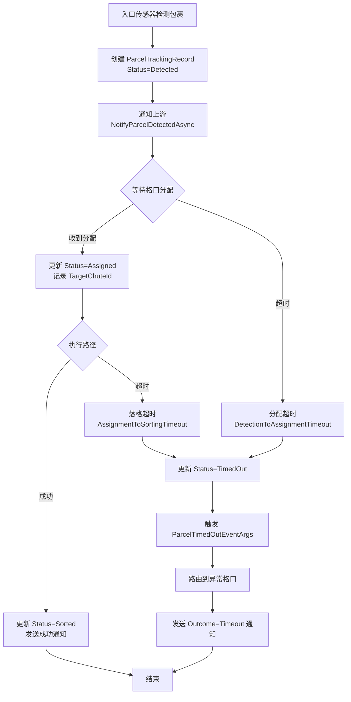
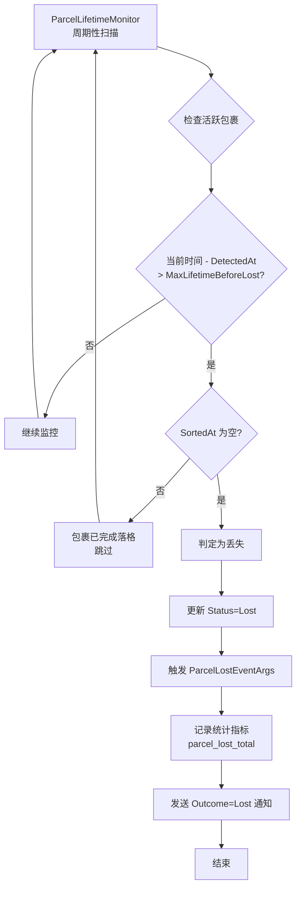

# ZakYip.WheelDiverterSorter

[](https://github.com/Hisoka6602/ZakYip.WheelDiverterSorter/actions/workflows/dotnet.yml)
[](https://codecov.io/gh/Hisoka6602/ZakYip.WheelDiverterSorter)

直线摆轮分拣系统 - 基于方向控制的包裹自动分拣解决方案

## 系统概述

基于直线摆轮（Wheel Diverter）的包裹自动分拣系统。包裹通过传感器检测进入系统，在输送线上单向移动，经过配置的摆轮节点时，根据转向方向（左/右/直行）分流到目标格口。

### 系统拓扑

```
                    ┌─────────┐
                    │  格口B   │ (摆轮D1左转)
                    └────▲────┘
                         │
入口传感器 ──▶ [摆轮D1] ──▶ [摆轮D2] ──▶ [摆轮D3] ──▶ 末端(异常口999)
    │              │           │           │
    ▼              ▼           ▼           ▼
 创建包裹     ┌─────────┐ ┌─────────┐ ┌─────────┐
             │  格口A   │ │  格口C   │ │  格口E   │
             │(D1右转)  │ │(D2右转)  │ │(D3右转)  │
             └─────────┘ └─────────┘ └─────────┘
                    ┌─────────┐ ┌─────────┐
                    │  格口D   │ │  格口F   │
                    │(D2左转)  │ │(D3左转)  │
                    └─────────┘ └─────────┘
```

**说明**：
- 每个摆轮前有感应传感器（FrontSensor）检测包裹到达
- 摆轮支持三个方向：左转、右转、直行
- 包裹沿输送线单向移动，无法后退
- 未分拣的包裹最终到达末端异常格口

### 分拣流程

```
┌──────────────┐     ┌──────────────┐     ┌──────────────┐
│ 1. 包裹检测   │────▶│ 2. 格口分配   │────▶│ 3. 路径生成   │
│ 入口传感器触发 │     │ 上游/固定/轮询 │     │ 查询拓扑配置  │
│ 创建包裹实体  │     │              │     │              │
└──────────────┘     └──────────────┘     └──────────────┘
                                                │
                                                ▼
┌──────────────┐     ┌──────────────┐     ┌──────────────┐
│ 6. 完成分拣   │◀────│ 5. 确认落格   │◀────│ 4. 路径执行   │
│ 记录结果     │     │ 格口传感器确认 │     │ 控制摆轮转向  │
└──────────────┘     └──────────────┘     └──────────────┘
```

**异常处理**：任意步骤失败（超时/设备异常/连接失败）→ 路由到异常格口

### 包裹超时与丢失判定

系统通过 `ParcelLifetimeMonitor` 后台服务周期性扫描活跃包裹，判定超时和丢失状态。

#### 包裹超时如何判断

包裹超时是指在特定阶段的时间窗口内未能完成对应步骤。系统定义两种超时类型：

1. **分配超时**（格口分配超时）
   - 条件：包裹状态为 `Detected` 且 `AssignedAt == null`
   - 触发：`当前时间 - DetectedAt > DetectionToAssignmentTimeout`
   - 含义：包裹检测后超过配置时间仍未收到格口分配

2. **落格超时**（路径执行超时）
   - 条件：包裹状态为 `Assigned` 或 `Routing` 且 `SortedAt == null`
   - 触发：`当前时间 - AssignedAt > AssignmentToSortingTimeout`
   - 含义：包裹已分配格口后超过配置时间仍未完成落格

**超时处理流程**：
1. 更新包裹状态为 `TimedOut`
2. 触发 `ParcelTimedOutEventArgs` 事件
3. 尝试路由到异常格口
4. 向上游发送 `Outcome=Timeout` 的 `SortingCompletedNotification`

#### 包裹丢失如何判断

包裹丢失是指超出系统允许的最大存活时间，仍未完成落格且无法确定位置。

**判定条件**：
- 包裹状态非 `Sorted`（未完成落格）
- `SortedAt == null`
- `当前时间 - DetectedAt > MaxLifetimeBeforeLost`

**丢失与超时的区别**：
| 属性 | 超时 | 丢失 |
|------|------|------|
| 定义 | 特定阶段时间窗口内未完成步骤 | 超出最大存活时间仍未落格 |
| 状态 | 可能被找回（如果设备恢复） | 视为永久丢失 |
| 处理 | 尝试路由到异常格口 | 仅记录和统计 |

**丢失处理流程**：
1. 更新包裹状态为 `Lost`
2. 触发 `ParcelLostEventArgs` 事件
3. 记录 `parcel_lost_total` 等统计指标
4. 向上游发送 `Outcome=Lost` 的 `SortingCompletedNotification`

#### 包裹超时处理流程图



#### 包裹丢失处理流程图



#### 超时配置说明

配置项位于 `ParcelTimeoutOptions`，可通过 `appsettings.json` 配置：

```json
{
  "ParcelTimeout": {
    "DetectionToAssignmentTimeoutSeconds": 5,
    "AssignmentToSortingTimeoutSeconds": 30,
    "MaxLifetimeBeforeLostSeconds": 120
  }
}
```

| 配置项 | 默认值 | 说明 |
|--------|--------|------|
| DetectionToAssignmentTimeout | 5 秒 | 从检测到收到格口分配的最大等待时间 |
| AssignmentToSortingTimeout | 30 秒 | 从分配格口到落格确认的最大等待时间 |
| MaxLifetimeBeforeLost | 120 秒 | 包裹在系统中的最大存活时长 |

### 核心特点

- ✅ 方向控制模式（左/右/直行）
- ✅ 传感器驱动，实时跟踪包裹位置
- ✅ LiteDB 动态配置，支持运行时热更新
- ✅ 多协议通信（TCP/SignalR/MQTT/HTTP）
- ✅ 完整异常处理，自动路由到异常格口
- ✅ 三种分拣模式（正式/指定落格/循环落格）

## 项目结构

```
src/
├── Host/           # ASP.NET Core 宿主应用（API、后台服务）
├── Application/    # 应用服务层，DI 聚合入口
├── Core/           # 核心领域模型、配置仓储、HAL 抽象
├── Execution/      # 分拣执行管线、路径执行、SortingOrchestrator
├── Drivers/        # 硬件驱动（雷赛/西门子/摩迪/书迪鸟/仿真）
├── Ingress/        # 传感器管理、包裹检测
├── Communication/  # 上游通信（TCP/SignalR/MQTT/HTTP）
├── Observability/  # 监控指标、日志、告警
└── Simulation/     # 仿真运行环境

tests/              # 测试项目（单元/集成/E2E/架构/性能）
monitoring/         # Prometheus/Grafana 配置
```

## 快速开始

### 运行项目

```bash
cd src/Host/ZakYip.WheelDiverterSorter.Host
dotnet run
```

默认监听端口：5000（HTTP），访问 Swagger UI：http://localhost:5000/swagger

### 运行测试

```bash
dotnet test
```

### 生产环境部署

```bash
dotnet publish src/Host/ZakYip.WheelDiverterSorter.Host -c Release -o out/host
cd out/host
DOTNET_ENVIRONMENT=Production ASPNETCORE_URLS=http://0.0.0.0:5000 ./ZakYip.WheelDiverterSorter.Host
```

## API 概览

| 端点 | 说明 |
|------|------|
| `GET/PUT /api/config/system` | 系统配置（分拣模式、异常格口等） |
| `GET/PUT /api/config/communication` | 上游通信配置 |
| `GET/PUT /api/config/chute-path-topology` | 格口路径拓扑 |
| `GET /healthz` | 进程级健康检查 |
| `GET /health/line` | 线体级健康检查 |

## 分拣模式

| 模式 | 说明 | 使用场景 |
|------|------|----------|
| Formal | 与上游 RuleEngine 集成 | 生产环境 |
| FixedChute | 所有包裹发送到固定格口 | 调试测试 |
| RoundRobin | 按配置列表循环分配 | 均匀分布测试 |

## 上游通信数据结构

系统支持与上游 RuleEngine 通过多种协议（TCP/SignalR/MQTT/HTTP）进行通信。以下是通信过程中使用的核心数据结构：

### 通信流程

```
┌──────────────────┐                      ┌──────────────────┐
│   分拣系统        │                      │   RuleEngine     │
│  (WheelDiverter) │                      │   (上游系统)      │
└────────┬─────────┘                      └────────┬─────────┘
         │                                         │
         │  1. ParcelDetectionNotification         │
         │  ─────────────────────────────────────▶ │
         │  (包裹检测通知)                          │
         │                                         │
         │  2. ChuteAssignmentResponse             │
         │  ◀───────────────────────────────────── │
         │  (格口分配响应)                          │
         │                                         │
```

### 数据结构定义

#### ParcelDetectionNotification（包裹检测通知）

当系统检测到包裹时，发送此通知给 RuleEngine。

```json
{
  "ParcelId": 1701446263000,
  "DetectionTime": "2024-12-01T18:57:43+08:00",
  "Metadata": {
    "SensorId": "Sensor001",
    "LineId": "Line01"
  }
}
```

| 字段 | 类型 | 必填 | 说明 |
|------|------|------|------|
| `ParcelId` | long | ✅ | 包裹ID（毫秒时间戳） |
| `DetectionTime` | DateTimeOffset | ✅ | 检测时间 |
| `Metadata` | Dictionary<string, string> | ❌ | 额外的元数据（可选） |

#### ChuteAssignmentRequest（格口分配请求）

分拣系统向上游请求格口分配时使用。

```json
{
  "ParcelId": 1701446263000,
  "RequestTime": "2024-12-01T18:57:43+08:00"
}
```

| 字段 | 类型 | 必填 | 说明 |
|------|------|------|------|
| `ParcelId` | long | ✅ | 包裹ID（毫秒时间戳） |
| `RequestTime` | DateTimeOffset | ✅ | 请求时间 |

#### ChuteAssignmentResponse（格口分配响应）

上游 RuleEngine 返回的格口分配结果。

```json
{
  "ParcelId": 1701446263000,
  "ChuteId": 101,
  "IsSuccess": true,
  "ErrorMessage": null,
  "ResponseTime": "2024-12-01T18:57:43.500+08:00"
}
```

| 字段 | 类型 | 必填 | 说明 |
|------|------|------|------|
| `ParcelId` | long | ✅ | 包裹ID（毫秒时间戳） |
| `ChuteId` | long | ✅ | 目标格口ID（数字ID） |
| `IsSuccess` | bool | ✅ | 是否成功（默认 true） |
| `ErrorMessage` | string | ❌ | 错误消息（如果失败） |
| `ResponseTime` | DateTimeOffset | ✅ | 响应时间 |

#### ChuteAssignmentEventArgs（格口分配事件参数）

系统内部事件传递使用的数据结构（定义在 Core 层）。

```json
{
  "ParcelId": 1701446263000,
  "ChuteId": 101,
  "NotificationTime": "2024-12-01T18:57:43.500+08:00",
  "Metadata": null
}
```

| 字段 | 类型 | 必填 | 说明 |
|------|------|------|------|
| `ParcelId` | long | ✅ | 包裹ID |
| `ChuteId` | long | ✅ | 分配的格口ID |
| `NotificationTime` | DateTimeOffset | ✅ | 通知时间 |
| `Metadata` | Dictionary<string, string> | ❌ | 额外的元数据（可选） |

### 源码位置

| 数据结构 | 位置 |
|---------|------|
| `ParcelDetectionNotification` | `src/Infrastructure/ZakYip.WheelDiverterSorter.Communication/Models/` |
| `ChuteAssignmentRequest` | `src/Infrastructure/ZakYip.WheelDiverterSorter.Communication/Models/` |
| `ChuteAssignmentResponse` | `src/Infrastructure/ZakYip.WheelDiverterSorter.Communication/Models/` |
| `ChuteAssignmentEventArgs` | `src/Core/ZakYip.WheelDiverterSorter.Core/Abstractions/Upstream/` |
| `IUpstreamRoutingClient` | `src/Core/ZakYip.WheelDiverterSorter.Core/Abstractions/Upstream/` |

## 文档导航

| 文档 | 说明 |
|------|------|
| [docs/RepositoryStructure.md](docs/RepositoryStructure.md) | 仓库结构、技术债索引 |
| [docs/DOCUMENTATION_INDEX.md](docs/DOCUMENTATION_INDEX.md) | 完整文档索引 |
| [.github/copilot-instructions.md](.github/copilot-instructions.md) | Copilot 约束说明 |

## 技术栈

- .NET 8.0
- ASP.NET Core
- LiteDB
- Prometheus + Grafana

---

**维护团队：** ZakYip Development Team
