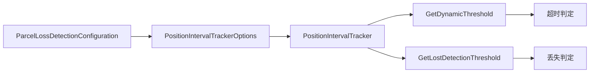

# 包裹丢失检测计算系数说明 (Parcel Loss Detection Formula Explanation)

> **文档版本**: 1.0  
> **创建日期**: 2025-12-15  
> **适用系统**: ZakYip 摆轮分拣系统

---

## 概述 (Overview)

本文档详细说明包裹丢失检测系统中的计算系数如何生效，包括：
- 计算公式详解
- 系数的作用机制
- 实际代码实现
- 配置示例与调优建议

---

## 1. 核心概念

### 1.1 两种检测机制

系统使用两种独立的检测机制来判断包裹状态：

| 检测类型 | 触发时机 | 判定依据 | 处理方式 |
|---------|---------|---------|---------|
| **超时检测 (Timeout Detection)** | IO触发时（被动） | 包裹比预期晚到达 | 使用Straight动作，继续处理 |
| **丢失检测 (Lost Detection)** | 定期扫描（主动） | 包裹长时间未到达 | 触发ParcelLost事件，从队列移除 |

### 1.2 关键时间点

```
包裹创建    期望到达时间    超时边界    丢失边界
   |           |             |           |
   |-----------|-------------|-----------|-------> 时间轴
   |           |<- 理论间隔 ->|           |
   |           |             |<- 超时容差 ->|
   |           |                         |<- 丢失容差 ->|
```

---

## 2. 计算公式详解

### 2.1 中位数间隔计算

**用途**：作为动态阈值的基准值

**公式**：
```
中位数间隔 = Median(最近N个包裹的间隔时间)
```

**实现位置**：`PositionIntervalTracker.cs` (行249-260)

```csharp
private static double CalculateMedian(double[] values)
{
    if (values.Length == 0)
        return 0;
    
    var sorted = values.OrderBy(v => v).ToArray();
    int n = sorted.Length;
    
    return n % 2 == 0
        ? (sorted[n / 2 - 1] + sorted[n / 2]) / 2.0  // 偶数个样本：取中间两个平均
        : sorted[n / 2];                              // 奇数个样本：取中间值
}
```

**特点**：
- 使用中位数而非平均值，抗异常值干扰
- 窗口大小默认为10个样本（可配置）
- 每个Position独立计算

### 2.2 超时检测阈值

**用途**：判断包裹是否超时（但未丢失）

**公式**：
```
超时阈值 = 中位数间隔 × 超时检测系数

其中：
  超时检测系数 (TimeoutMultiplier) = 3.0  (默认值，可配置范围：1.5-10.0)
```

**实现位置**：`PositionIntervalTracker.cs` (行185)

```csharp
public double? GetDynamicThreshold(int positionIndex)
{
    // ...数据验证...
    
    var intervals = buffer.ToArray();
    var median = CalculateMedian(intervals);
    
    // ✅ 系数生效位置：直接将中位数乘以超时系数
    var threshold = median * _options.TimeoutMultiplier;
    
    return threshold;
}
```

**实际使用位置**：`PositionIndexQueueManager.cs`
```csharp
// 在包裹入队时计算超时截止时间
var timeoutThresholdMs = _intervalTracker?.GetDynamicThreshold(positionIndex);
if (timeoutThresholdMs.HasValue)
{
    var timeoutDeadline = expectedArrivalTime.AddMilliseconds(timeoutThresholdMs.Value);
    task = task with { TimeoutDeadline = timeoutDeadline };
}
```

### 2.3 丢失检测阈值

**用途**：判断包裹是否物理丢失（需要从队列移除）

**公式**：
```
丢失阈值 = 中位数间隔 × 丢失检测系数

其中：
  丢失检测系数 (LostDetectionMultiplier) = 1.5  (默认值，可配置范围：1.0-5.0)
```

**实现位置**：`PositionIntervalTracker.cs` (行208)

```csharp
public double? GetLostDetectionThreshold(int positionIndex)
{
    // ...数据验证...
    
    var intervals = buffer.ToArray();
    var median = CalculateMedian(intervals);
    
    // ✅ 系数生效位置：直接将中位数乘以丢失系数
    var lostThreshold = median * _options.LostDetectionMultiplier;
    
    _logger.LogDebug(
        "[丢失检测阈值] Position {PositionIndex}: 中位数={MedianMs}ms, 系数={Factor}, 阈值={ThresholdMs}ms",
        positionIndex, median, _options.LostDetectionMultiplier, lostThreshold);
    
    return lostThreshold;
}
```

**实际使用位置**：`PositionIndexQueueManager.cs`
```csharp
// 在包裹入队时计算丢失截止时间
var lostThresholdMs = _intervalTracker?.GetLostDetectionThreshold(positionIndex);
if (lostThresholdMs.HasValue)
{
    var lostDeadline = expectedArrivalTime.AddMilliseconds(lostThresholdMs.Value);
    task = task with { LostDetectionDeadline = lostDeadline };
}
```

---

## 3. 系数生效流程

### 3.1 系数配置流程



### 3.2 配置加载位置

**配置模型**：`ParcelLossDetectionConfiguration.cs`
```csharp
public class ParcelLossDetectionConfiguration
{
    /// <summary>
    /// 丢失检测系数
    /// 丢失阈值 = 中位数间隔 * 丢失检测系数
    /// </summary>
    public double LostDetectionMultiplier { get; set; } = 1.5;

    /// <summary>
    /// 超时检测系数
    /// 超时阈值 = 中位数间隔 * 超时检测系数
    /// </summary>
    public double TimeoutMultiplier { get; set; } = 3.0;
}
```

**DI注册**：`WheelDiverterSorterServiceCollectionExtensions.cs` (行436-437)
```csharp
services.Configure<PositionIntervalTrackerOptions>(options =>
{
    options.TimeoutMultiplier = 3.0;          // ✅ 超时系数注入
    options.LostDetectionMultiplier = 1.5;    // ✅ 丢失系数注入
});
```

### 3.3 运行时使用流程

```
1. 包裹入队（EnqueueTask）
   └─> 调用 GetDynamicThreshold(positionIndex)
       └─> 返回：中位数 × TimeoutMultiplier
   └─> 调用 GetLostDetectionThreshold(positionIndex)
       └─> 返回：中位数 × LostDetectionMultiplier
   └─> 设置任务的超时和丢失截止时间

2. IO触发时（超时检测）
   └─> 检查 currentTime > task.TimeoutDeadline
       └─> 是：使用Straight动作
       └─> 否：使用计划动作

3. 后台扫描（丢失检测）
   └─> 检查 currentTime > task.LostDetectionDeadline
       └─> 是：触发ParcelLost事件，从队列移除
       └─> 否：继续等待
```

---

## 4. 实际计算示例

### 4.1 场景：正常分拣流程

**假设条件**：
- Position 1（第一个摆轮）的最近10次间隔：
  ```
  [950ms, 980ms, 1000ms, 1020ms, 990ms, 1010ms, 1005ms, 995ms, 1015ms, 985ms]
  ```
- 当前配置：
  - LostDetectionMultiplier = 1.5
  - TimeoutMultiplier = 3.0

**计算步骤**：

1. **计算中位数**：
   ```
   排序后：[950, 980, 985, 990, 995, 1000, 1005, 1010, 1015, 1020]
   样本数 = 10（偶数）
   中位数 = (995 + 1000) / 2 = 997.5ms
   ```

2. **计算丢失阈值**：
   ```
   丢失阈值 = 997.5 × 1.5 = 1496.25ms
   ```

3. **计算超时阈值**：
   ```
   超时阈值 = 997.5 × 3.0 = 2992.5ms
   ```

4. **设置包裹截止时间**：
   ```
   期望到达时间 = 2025-12-15 10:00:00.000
   丢失判定截止时间 = 10:00:00.000 + 1496ms = 10:00:01.496
   超时判定截止时间 = 10:00:00.000 + 2993ms = 10:00:02.993
   ```

**判定结果**：

| 实际到达时间 | 延迟 | 判定结果 | 处理方式 |
|------------|------|---------|---------|
| 10:00:00.500 | +500ms | ✅ 正常 | 执行计划动作 |
| 10:00:01.200 | +1200ms | ⚠️ 接近丢失边界 | 执行计划动作 |
| 10:00:01.600 | +1600ms | ❌ 超过丢失阈值 | 触发丢失事件，移除 |
| 10:00:03.500 | +3500ms | ❌ 超过超时阈值（被动检测） | 使用Straight动作 |

### 4.2 场景：高速分拣（间隔更短）

**假设条件**：
- Position 2 的最近10次间隔（高速线体）：
  ```
  [400ms, 420ms, 390ms, 410ms, 415ms, 395ms, 405ms, 412ms, 398ms, 408ms]
  ```

**计算步骤**：

1. **中位数**：
   ```
   排序后：[390, 395, 398, 400, 405, 408, 410, 412, 415, 420]
   中位数 = (405 + 408) / 2 = 406.5ms
   ```

2. **阈值**：
   ```
   丢失阈值 = 406.5 × 1.5 = 609.75ms
   超时阈值 = 406.5 × 3.0 = 1219.5ms
   ```

**对比分析**：
- 高速线体的间隔更短，阈值也相应更短
- 系统自适应调整，无需手动配置每个Position的阈值

### 4.3 场景：系数调优

**问题**：生产环境中出现较多误判（正常包裹被判定为丢失）

**原因分析**：
- 线体速度波动较大
- 默认丢失系数1.5过于严格

**调优方案**：
```bash
# 通过 API 调整丢失检测系数
PUT /api/sorting/parcel-loss-detection/config
{
  "lostDetectionMultiplier": 2.0,    # 从1.5提高到2.0（更宽松）
  "timeoutMultiplier": 3.5           # 从3.0提高到3.5（更宽松）
}
```

**调优效果**：
```
调优前：
  中位数 = 1000ms
  丢失阈值 = 1000 × 1.5 = 1500ms  → 误判率 5%
  超时阈值 = 1000 × 3.0 = 3000ms

调优后：
  中位数 = 1000ms
  丢失阈值 = 1000 × 2.0 = 2000ms  → 误判率 < 1%
  超时阈值 = 1000 × 3.5 = 3500ms
```

---

## 5. 配置参数说明

### 5.1 系数参数详解

| 参数名 | 默认值 | 取值范围 | 说明 |
|-------|-------|---------|------|
| **LostDetectionMultiplier** | 1.5 | 1.0 - 5.0 | 值越小，判定越严格（容易误判）；值越大，判定越宽松（可能漏检） |
| **TimeoutMultiplier** | 3.0 | 1.5 - 10.0 | 值越小，超时判定越激进；值越大，超时判定越保守 |
| **WindowSize** | 10 | 5 - 20 | 滑动窗口大小，影响中位数计算的平滑度 |
| **MonitoringIntervalMs** | 60ms | 50 - 500ms | 后台扫描间隔，影响丢失检测的及时性 |

### 5.2 系数选择建议

**LostDetectionMultiplier 选择**：

| 场景 | 推荐值 | 理由 |
|------|-------|------|
| 高精度设备（传感器稳定） | 1.5 | 严格检测，减少假阴性（漏检） |
| 标准设备（少量波动） | 2.0 | 平衡精度与容错 |
| 不稳定设备（波动较大） | 2.5 - 3.0 | 宽松检测，减少假阳性（误判） |

**TimeoutMultiplier 选择**：

| 场景 | 推荐值 | 理由 |
|------|-------|------|
| 高速分拣（> 1.5 m/s） | 2.5 - 3.0 | 快速响应，避免阻塞后续包裹 |
| 标准分拣（1.0 - 1.5 m/s） | 3.0 - 3.5 | 标准配置 |
| 低速分拣（< 1.0 m/s） | 3.5 - 4.5 | 更宽松的超时判定 |

---

## 6. API 使用示例

### 6.1 查询当前配置

```bash
GET /api/sorting/parcel-loss-detection/config

# 响应示例
{
  "success": true,
  "data": {
    "monitoringIntervalMs": 60,
    "lostDetectionMultiplier": 1.5,
    "timeoutMultiplier": 3.0,
    "windowSize": 10,
    "version": 1,
    "createdAt": "2025-12-15T08:00:00",
    "updatedAt": "2025-12-15T10:30:00"
  }
}
```

### 6.2 更新配置

```bash
PUT /api/sorting/parcel-loss-detection/config
Content-Type: application/json

{
  "monitoringIntervalMs": 80,
  "lostDetectionMultiplier": 2.0,
  "timeoutMultiplier": 3.5,
  "windowSize": 15
}

# 响应示例
{
  "success": true,
  "message": "包裹丢失检测配置已更新",
  "data": {
    "monitoringIntervalMs": 80,
    "lostDetectionMultiplier": 2.0,
    "timeoutMultiplier": 3.5,
    "windowSize": 15,
    "version": 2,
    "updatedAt": "2025-12-15T10:35:00"
  }
}
```

### 6.3 查看实时统计

```bash
GET /api/sorting/position-intervals

# 响应示例
[
  {
    "positionIndex": 1,
    "medianIntervalMs": 997.5,
    "sampleCount": 10,
    "minIntervalMs": 950.0,
    "maxIntervalMs": 1020.0,
    "lostThresholdMs": 1496.25,    # ✅ 997.5 × 1.5
    "timeoutThresholdMs": 2992.5,  # ✅ 997.5 × 3.0
    "lastUpdatedAt": "2025-12-15T10:40:00"
  },
  {
    "positionIndex": 2,
    "medianIntervalMs": 406.5,
    "sampleCount": 10,
    "minIntervalMs": 390.0,
    "maxIntervalMs": 420.0,
    "lostThresholdMs": 609.75,     # ✅ 406.5 × 1.5
    "timeoutThresholdMs": 1219.5,  # ✅ 406.5 × 3.0
    "lastUpdatedAt": "2025-12-15T10:40:15"
  }
]
```

---

## 7. 代码追踪路径

### 7.1 系数从配置到使用的完整路径

```
1. 配置定义
   └─> ParcelLossDetectionConfiguration.cs
       └─> LostDetectionMultiplier = 1.5
       └─> TimeoutMultiplier = 3.0

2. 配置加载到Options
   └─> WheelDiverterSorterServiceCollectionExtensions.cs (行436-437)
       └─> Configure<PositionIntervalTrackerOptions>

3. Options注入到服务
   └─> PositionIntervalTracker 构造函数
       └─> _options = IOptions<PositionIntervalTrackerOptions>

4. 实际计算使用
   └─> GetDynamicThreshold() (行185)
       └─> threshold = median * _options.TimeoutMultiplier
   └─> GetLostDetectionThreshold() (行208)
       └─> lostThreshold = median * _options.LostDetectionMultiplier

5. 应用到包裹任务
   └─> PositionIndexQueueManager.EnqueueTask()
       └─> task.TimeoutDeadline = expectedTime + threshold
       └─> task.LostDetectionDeadline = expectedTime + lostThreshold

6. 判定检查
   └─> IO触发时：检查 currentTime > TimeoutDeadline
   └─> 后台扫描：检查 currentTime > LostDetectionDeadline
```

### 7.2 关键文件列表

| 文件路径 | 作用 | 关键代码行 |
|---------|------|-----------|
| `Core/LineModel/Configuration/Models/ParcelLossDetectionConfiguration.cs` | 配置模型定义 | 42, 52 |
| `Execution/Tracking/PositionIntervalTracker.cs` | 阈值计算实现 | 185, 208 |
| `Execution/Tracking/IPositionIntervalTracker.cs` | 接口定义 | 56行注释 |
| `Execution/Monitoring/ParcelLossMonitoringService.cs` | 丢失检测服务 | 154 |
| `Execution/Queues/PositionIndexQueueManager.cs` | 队列管理（使用阈值） | - |
| `Application/Extensions/WheelDiverterSorterServiceCollectionExtensions.cs` | DI配置 | 436-437 |
| `Host/Controllers/SortingController.cs` | API端点 | 844-845, 994-995 |

---

## 8. 验证系数生效的方法

### 8.1 日志验证

启用Debug日志后，可以看到系数应用的详细信息：

```log
[DEBUG] [丢失检测阈值] Position 1: 中位数=997.5ms, 系数=1.5, 阈值=1496.25ms
[DEBUG] [超时检测] Position 1: 中位数=997.5ms, 系数=3.0, 阈值=2992.5ms
```

### 8.2 API验证

通过API查看实时计算结果：

```bash
# 1. 查看当前配置的系数
GET /api/sorting/parcel-loss-detection/config

# 2. 查看实时统计（包含计算后的阈值）
GET /api/sorting/position-intervals

# 3. 修改系数后观察阈值变化
PUT /api/sorting/parcel-loss-detection/config
{"lostDetectionMultiplier": 2.0}

# 4. 再次查看统计，确认阈值已更新
GET /api/sorting/position-intervals
```

### 8.3 代码断点验证

在以下位置设置断点，观察变量值：

```csharp
// PositionIntervalTracker.cs:185
var threshold = median * _options.TimeoutMultiplier;
// 断点：查看 median, _options.TimeoutMultiplier, threshold

// PositionIntervalTracker.cs:208
var lostThreshold = median * _options.LostDetectionMultiplier;
// 断点：查看 median, _options.LostDetectionMultiplier, lostThreshold
```

---

## 9. 常见问题 (FAQ)

### Q1: 系数是否真的生效？

**答**：是的，系数在两个地方直接参与计算：
- 超时阈值 = 中位数 × TimeoutMultiplier（代码行185）
- 丢失阈值 = 中位数 × LostDetectionMultiplier（代码行208）

可以通过以下方式验证：
1. 查看Debug日志，系数值会被记录
2. 调用API查看实时阈值计算结果
3. 修改系数后，阈值会立即变化

### Q2: 为什么使用中位数而非平均值？

**答**：中位数相比平均值有以下优势：
- **抗异常值**：偶尔的极端值（如网络抖动导致的超长间隔）不会严重影响计算结果
- **更稳定**：在包裹流量波动时，中位数变化更平滑
- **更准确**：反映"典型"包裹的实际间隔

示例：
```
间隔样本：[1000, 1010, 1020, 1005, 5000]  (最后一个为异常值)
平均值：(1000+1010+1020+1005+5000)/5 = 1807ms  (被异常值拉高)
中位数：1010ms  (✅ 反映真实情况)
```

### Q3: 两个系数之间有什么关系？

**答**：两个系数独立工作，用于不同场景：

| 系数 | 用途 | 触发方式 | 严重性 |
|-----|------|---------|-------|
| LostDetectionMultiplier | 判定包裹物理丢失 | 后台主动扫描 | 🔴 高（需要从队列移除） |
| TimeoutMultiplier | 判定包裹延迟到达 | IO触发时被动检测 | 🟡 中（使用Straight动作） |

**优先级**：丢失判定 > 超时判定

如果包裹同时满足两个条件，会按丢失处理（更严重）。

### Q4: 修改系数后需要重启系统吗？

**答**：不需要。配置通过API更新后立即生效：
1. 配置保存到数据库
2. Options系统自动重新加载
3. 下次计算阈值时使用新系数

### Q5: 如何确定合适的系数值？

**答**：建议通过以下步骤调优：

1. **收集基线数据**（运行1小时以上）：
   ```bash
   GET /api/sorting/position-intervals
   ```
   观察medianIntervalMs的稳定性

2. **评估误判率**：
   - 查看日志中的丢失/超时事件数量
   - 与实际物理丢失数量对比

3. **逐步调整**：
   - 误判多（假阳性）→ 增大系数（更宽松）
   - 漏检多（假阴性）→ 减小系数（更严格）

4. **A/B测试**：
   - 在测试环境测试不同系数组合
   - 选择误判率和检测率最佳平衡点

---

## 10. 相关文档

- [包裹丢失检测与处理指南](./guides/PARCEL_LOSS_DETECTION.md) - 完整的检测机制说明
- [核心路由逻辑](./CORE_ROUTING_LOGIC.md) - Position队列机制
- [系统配置指南](./guides/SYSTEM_CONFIG_GUIDE.md) - 配置管理

---

## 附录：完整公式汇总

### A1. 中位数计算

```
给定样本: [x₁, x₂, ..., xₙ]
排序后: [y₁, y₂, ..., yₙ] (y₁ ≤ y₂ ≤ ... ≤ yₙ)

中位数 = 
  ├─ (yₙ/₂ + yₙ/₂₊₁) / 2    当 n 为偶数
  └─ y₍ₙ₊₁₎/₂                当 n 为奇数
```

### A2. 阈值计算

```
丢失阈值 = Median(间隔样本) × LostDetectionMultiplier
超时阈值 = Median(间隔样本) × TimeoutMultiplier
```

### A3. 截止时间计算

```
丢失判定截止时间 = 期望到达时间 + 丢失阈值
超时判定截止时间 = 期望到达时间 + 超时阈值
```

### A4. 判定条件

```
当 当前时间 > 丢失判定截止时间:
    → 触发丢失事件，从队列移除包裹

当 当前时间 > 超时判定截止时间 AND IO触发:
    → 使用Straight动作继续处理
```

---

**维护团队**: ZakYip Development Team  
**文档维护**: 请确保代码修改时同步更新本文档  
**反馈渠道**: 请通过 GitHub Issues 报告问题或建议
