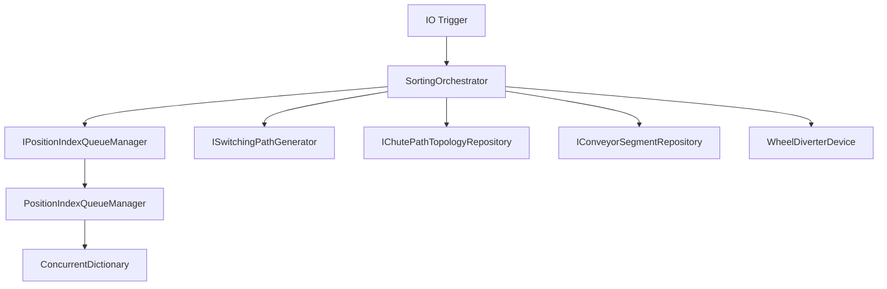
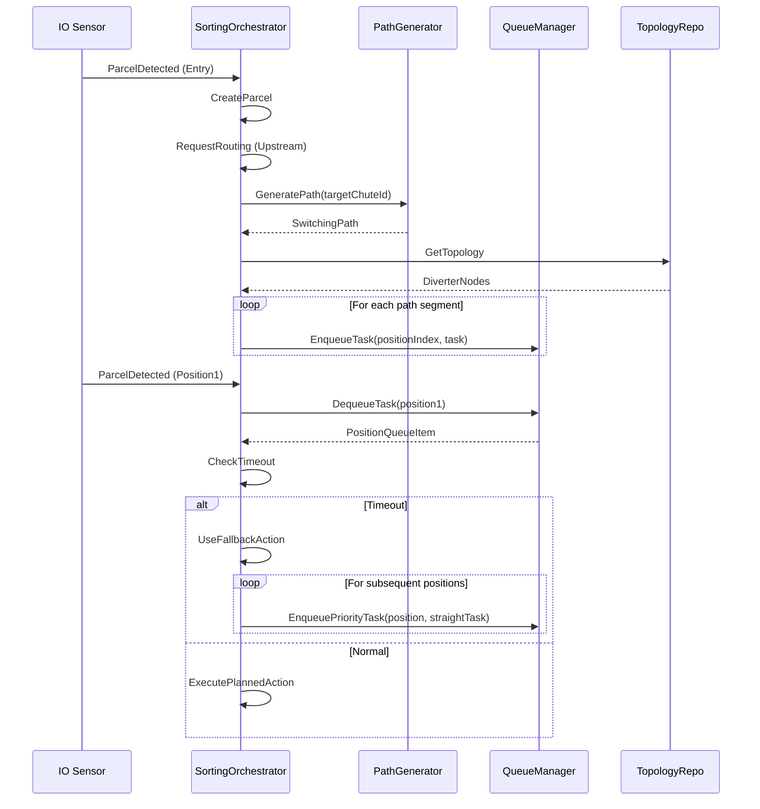

# Position-Index 队列系统剩余工作 (Phase 4, 6, 8-9)

**文档版本**: 1.0  
**创建日期**: 2025-12-12  
**状态**: 待执行

## 📋 总览

本文档详细描述 Position-Index-Based Queue System 重构的剩余工作，包括 Phase 4（包裹创建与任务入队）、Phase 6（面板控制集成）、Phase 8（测试与验证）和 Phase 9（文档更新）。

**当前完成度**: 13/25 小时 (52%)

**已完成 Phase**:
- ✅ Phase 1: API 配置清理 (2小时)
- ✅ Phase 2: Position-Index 队列系统核心实现 + 优先队列 (4小时)
- ✅ Phase 3-5: 旧系统移除 + 超时处理 (3小时)
- ✅ Phase 7: 包裹丢失检测文档 (2小时)

**待完成 Phase**:
- ⏳ Phase 4: 包裹创建与任务入队 (3小时)
- ⏳ Phase 6: 面板控制集成 (1小时)
- ⏳ Phase 8: 测试与验证 (8小时)
- ⏳ Phase 9: 文档更新 (2小时)

## 🎯 拆分方案：3 个独立 PR

### PR-QUEUE-2: 包裹创建与任务入队 (Phase 4)
**工作量**: 3小时  
**依赖**: 当前 PR (PR-QUEUE-1) 必须先合并

### PR-QUEUE-3: 面板控制集成 + 基础测试 (Phase 6 + Phase 8 部分)
**工作量**: 4小时  
**依赖**: PR-QUEUE-2 必须先合并

### PR-QUEUE-4: 完整测试 + 文档更新 (Phase 8 完整 + Phase 9)
**工作量**: 7小时  
**依赖**: PR-QUEUE-3 必须先合并

---

## 📦 PR-QUEUE-2: 包裹创建与任务入队 (Phase 4)

### 🎯 目标

实现完整的包裹创建和路径生成逻辑，将包裹路径中的每个节点转换为 PositionQueueItem 并加入对应的队列。

### 📝 需要修改的文件

#### 1. `SortingOrchestrator.cs` - ProcessParcelAsync 方法

**当前状态**: 标记为 TODO

**需要实现的逻辑**:

```csharp
/// <summary>
/// 处理包裹分拣请求（完整实现）
/// </summary>
private async Task<SortingResult> ProcessParcelAsync(long parcelId, long targetChuteId, CancellationToken cancellationToken)
{
    var stopwatch = Stopwatch.StartNew();
    
    // 获取系统配置和异常格口ID
    var systemConfig = _systemConfigRepository.Get();
    var exceptionChuteId = systemConfig.ExceptionChuteId;
    
    // 检查拓扑服务是否可用
    if (_queueManager == null || _topologyRepository == null || _segmentRepository == null)
    {
        _logger.LogError(
            "[拓扑服务缺失] 包裹 {ParcelId} 分拣失败：拓扑服务未配置",
            parcelId);
        
        stopwatch.Stop();
        return new SortingResult(
            IsSuccess: false,
            ParcelId: parcelId.ToString(),
            ActualChuteId: 0,
            TargetChuteId: targetChuteId,
            ExecutionTimeMs: stopwatch.Elapsed.TotalMilliseconds,
            FailureReason: "拓扑服务未配置"
        );
    }
    
    // 获取拓扑配置
    var topology = _topologyRepository.Get();
    if (topology == null)
    {
        _logger.LogError("[拓扑配置缺失] 包裹 {ParcelId} 无法获取拓扑配置", parcelId);
        
        stopwatch.Stop();
        return new SortingResult(
            IsSuccess: false,
            ParcelId: parcelId.ToString(),
            ActualChuteId: 0,
            TargetChuteId: targetChuteId,
            ExecutionTimeMs: stopwatch.Elapsed.TotalMilliseconds,
            FailureReason: "拓扑配置不存在"
        );
    }
    
    // 生成分拣路径
    _logger.LogDebug(
        "[路径生成] 开始为包裹 {ParcelId} 生成到格口 {TargetChuteId} 的分拣路径",
        parcelId,
        targetChuteId);
    
    var path = _pathGenerator.GeneratePath(targetChuteId);
    
    if (path == null || !path.Segments.Any())
    {
        _logger.LogError(
            "[路径生成失败] 包裹 {ParcelId} 无法生成到目标格口 {TargetChuteId} 的路径",
            parcelId, targetChuteId);
        
        stopwatch.Stop();
        return new SortingResult(
            IsSuccess: false,
            ParcelId: parcelId.ToString(),
            ActualChuteId: 0,
            TargetChuteId: targetChuteId,
            ExecutionTimeMs: stopwatch.Elapsed.TotalMilliseconds,
            FailureReason: "无法生成分拣路径"
        );
    }
    
    _logger.LogInformation(
        "[路径生成成功] 包裹 {ParcelId}: 段数={SegmentCount}, 目标格口={TargetChuteId}",
        parcelId,
        path.Segments.Count,
        targetChuteId);
    
    // 将路径转换为队列任务并入队
    var cumulativeTimeMs = 0.0;
    var enqueuedTasks = new List<(int PositionIndex, PositionQueueItem Task)>();
    
    foreach (var segment in path.Segments)
    {
        // 从拓扑中找到对应的摆轮节点
        var node = topology.DiverterNodes.FirstOrDefault(n => n.DiverterId == segment.DiverterId);
        if (node == null)
        {
            _logger.LogError(
                "[拓扑配置错误] 路径段 DiverterId={DiverterId} 在拓扑中未找到对应节点",
                segment.DiverterId);
            continue;
        }
        
        // 获取线体段配置以计算时间
        var segmentConfig = _segmentRepository.GetById(node.SegmentId);
        if (segmentConfig == null)
        {
            _logger.LogError(
                "[配置缺失] SegmentId={SegmentId} 的线体段配置不存在",
                node.SegmentId);
            continue;
        }
        
        // 计算理论到达时间（累加传输时间）
        var transitTimeMs = segmentConfig.CalculateTransitTimeMs();
        cumulativeTimeMs += transitTimeMs;
        
        var expectedArrivalTime = _clock.LocalNow.AddMilliseconds(cumulativeTimeMs);
        var timeoutThresholdMs = segmentConfig.CalculateTimeoutThresholdMs();
        
        // 创建队列任务
        var task = new PositionQueueItem
        {
            ParcelId = parcelId,
            DiverterId = segment.DiverterId,
            DiverterAction = segment.Direction,
            ExpectedArrivalTime = expectedArrivalTime,
            TimeoutThresholdMs = timeoutThresholdMs,
            FallbackAction = DiverterDirection.Straight,
            PositionIndex = node.PositionIndex,
            CreatedAt = _clock.LocalNow
        };
        
        // 加入队列
        _queueManager.EnqueueTask(node.PositionIndex, task);
        enqueuedTasks.Add((node.PositionIndex, task));
        
        _logger.LogDebug(
            "任务已加入队列: Position={PositionIndex}, ParcelId={ParcelId}, Action={Action}, ExpectedArrival={ExpectedArrival:HH:mm:ss.fff}, TimeoutMs={TimeoutMs}",
            node.PositionIndex,
            parcelId,
            segment.Direction,
            expectedArrivalTime,
            timeoutThresholdMs);
    }
    
    if (!enqueuedTasks.Any())
    {
        _logger.LogError(
            "[入队失败] 包裹 {ParcelId} 路径转换为队列任务失败，没有任何任务被加入队列",
            parcelId);
        
        stopwatch.Stop();
        return new SortingResult(
            IsSuccess: false,
            ParcelId: parcelId.ToString(),
            ActualChuteId: 0,
            TargetChuteId: targetChuteId,
            ExecutionTimeMs: stopwatch.Elapsed.TotalMilliseconds,
            FailureReason: "路径转换为队列任务失败"
        );
    }
    
    _logger.LogInformation(
        "[完成] 包裹 {ParcelId} 路径已转换为 {TaskCount} 个队列任务，目标格口: {TargetChuteId}, Positions: [{Positions}], 总用时: {ElapsedMs:F0}ms",
        parcelId,
        enqueuedTasks.Count,
        targetChuteId,
        string.Join(", ", enqueuedTasks.Select(t => t.PositionIndex)),
        stopwatch.Elapsed.TotalMilliseconds);
    
    stopwatch.Stop();
    return new SortingResult(
        IsSuccess: true,
        ParcelId: parcelId.ToString(),
        ActualChuteId: targetChuteId,
        TargetChuteId: targetChuteId,
        ExecutionTimeMs: stopwatch.Elapsed.TotalMilliseconds,
        FailureReason: null
    );
}
```

#### 2. 异常格口路径处理

当路径生成失败或目标格口不存在时，需要生成异常格口路径并入队：

```csharp
// 生成异常格口路径（所有摆轮直行）
var exceptionPath = _exceptionHandler.GenerateExceptionPath(
    exceptionChuteId,
    parcelId,
    "路径生成失败");

if (exceptionPath != null && exceptionPath.Segments.Any())
{
    // 将异常路径转换为队列任务
    var cumulativeTimeMs = 0.0;
    foreach (var segment in exceptionPath.Segments)
    {
        var node = topology.DiverterNodes.FirstOrDefault(n => n.DiverterId == segment.DiverterId);
        if (node == null) continue;
        
        var segmentConfig = _segmentRepository.GetById(node.SegmentId);
        if (segmentConfig == null) continue;
        
        cumulativeTimeMs += segmentConfig.CalculateTransitTimeMs();
        
        var task = new PositionQueueItem
        {
            ParcelId = parcelId,
            DiverterId = segment.DiverterId,
            DiverterAction = DiverterDirection.Straight, // 异常路径统一直行
            ExpectedArrivalTime = _clock.LocalNow.AddMilliseconds(cumulativeTimeMs),
            TimeoutThresholdMs = segmentConfig.CalculateTimeoutThresholdMs(),
            FallbackAction = DiverterDirection.Straight,
            PositionIndex = node.PositionIndex,
            CreatedAt = _clock.LocalNow
        };
        
        _queueManager.EnqueueTask(node.PositionIndex, task);
    }
    
    _logger.LogWarning(
        "包裹 {ParcelId} 使用异常格口路径，已加入队列: 目标格口={ExceptionChuteId}",
        parcelId,
        exceptionChuteId);
}
```

### ✅ 验收标准

1. 包裹创建后，路径中的每个节点都成功加入对应 Position 队列
2. 每个任务的 ExpectedArrivalTime 正确计算（累加传输时间）
3. 异常格口路径正确生成并入队
4. 日志完整记录入队过程（每个任务的 Position、Action、时间）
5. 编译通过，无警告

### 📊 工作量估算

- 实现 ProcessParcelAsync 完整逻辑: 1.5小时
- 异常路径处理: 0.5小时
- 日志和错误处理: 0.5小时
- 测试验证: 0.5小时
- **总计**: 3小时

---

## 🎮 PR-QUEUE-3: 面板控制集成 + 基础测试 (Phase 6 + Phase 8 部分)

### 🎯 目标

1. 在面板控制事件（停止/急停/复位）中清空所有队列
2. 添加基础单元测试验证核心功能

### 📝 需要修改的文件

#### 1. 面板控制服务集成

**文件**: 可能在 `Host` 或 `Application` 层的面板控制服务中

**需要添加的逻辑**:

```csharp
/// <summary>
/// 处理停止事件
/// </summary>
private void OnStopButtonPressed()
{
    _logger.LogInformation("面板停止按钮按下，清空所有队列");
    
    // 清空所有 Position-Index 队列
    _queueManager?.ClearAllQueues();
    
    // 其他停止逻辑...
}

/// <summary>
/// 处理急停事件
/// </summary>
private void OnEmergencyStopButtonPressed()
{
    _logger.LogWarning("面板急停按钮按下，清空所有队列");
    
    // 清空所有 Position-Index 队列
    _queueManager?.ClearAllQueues();
    
    // 其他急停逻辑...
}

/// <summary>
/// 处理复位事件
/// </summary>
private void OnResetButtonPressed()
{
    _logger.LogInformation("面板复位按钮按下，清空所有队列");
    
    // 清空所有 Position-Index 队列
    _queueManager?.ClearAllQueues();
    
    // 其他复位逻辑...
}
```

#### 2. 单元测试 - PositionIndexQueueManager

**新建文件**: `tests/.../Queues/PositionIndexQueueManagerTests.cs`

```csharp
using Xunit;
using Moq;
using Microsoft.Extensions.Logging;
using ZakYip.WheelDiverterSorter.Core.Utilities;
using ZakYip.WheelDiverterSorter.Execution.Queues;
using ZakYip.WheelDiverterSorter.Core.Enums.Hardware;

namespace ZakYip.WheelDiverterSorter.Execution.Tests.Queues;

public class PositionIndexQueueManagerTests
{
    private readonly Mock<ILogger<PositionIndexQueueManager>> _loggerMock;
    private readonly Mock<ISystemClock> _clockMock;
    private readonly PositionIndexQueueManager _queueManager;
    private readonly DateTime _testTime;

    public PositionIndexQueueManagerTests()
    {
        _loggerMock = new Mock<ILogger<PositionIndexQueueManager>>();
        _clockMock = new Mock<ISystemClock>();
        _testTime = new DateTime(2025, 12, 12, 10, 0, 0);
        _clockMock.Setup(c => c.LocalNow).Returns(_testTime);
        
        _queueManager = new PositionIndexQueueManager(_loggerMock.Object, _clockMock.Object);
    }

    [Fact]
    public void EnqueueTask_ShouldAddTaskToQueue()
    {
        // Arrange
        var task = CreateTestTask(parcelId: 1, positionIndex: 1);

        // Act
        _queueManager.EnqueueTask(1, task);

        // Assert
        Assert.Equal(1, _queueManager.GetQueueCount(1));
        Assert.False(_queueManager.IsQueueEmpty(1));
    }

    [Fact]
    public void DequeueTask_ShouldReturnTasksInFIFOOrder()
    {
        // Arrange
        var task1 = CreateTestTask(parcelId: 1, positionIndex: 1);
        var task2 = CreateTestTask(parcelId: 2, positionIndex: 1);
        var task3 = CreateTestTask(parcelId: 3, positionIndex: 1);

        _queueManager.EnqueueTask(1, task1);
        _queueManager.EnqueueTask(1, task2);
        _queueManager.EnqueueTask(1, task3);

        // Act & Assert
        var dequeued1 = _queueManager.DequeueTask(1);
        Assert.Equal(1, dequeued1?.ParcelId);

        var dequeued2 = _queueManager.DequeueTask(1);
        Assert.Equal(2, dequeued2?.ParcelId);

        var dequeued3 = _queueManager.DequeueTask(1);
        Assert.Equal(3, dequeued3?.ParcelId);

        Assert.True(_queueManager.IsQueueEmpty(1));
    }

    [Fact]
    public void EnqueuePriorityTask_ShouldInsertAtHead()
    {
        // Arrange
        var task1 = CreateTestTask(parcelId: 1, positionIndex: 1);
        var task2 = CreateTestTask(parcelId: 2, positionIndex: 1);
        var priorityTask = CreateTestTask(parcelId: 99, positionIndex: 1);

        _queueManager.EnqueueTask(1, task1);
        _queueManager.EnqueueTask(1, task2);

        // Act
        _queueManager.EnqueuePriorityTask(1, priorityTask);

        // Assert
        var dequeued = _queueManager.DequeueTask(1);
        Assert.Equal(99, dequeued?.ParcelId); // 优先任务应该在最前面
        
        Assert.Equal(1, _queueManager.DequeueTask(1)?.ParcelId);
        Assert.Equal(2, _queueManager.DequeueTask(1)?.ParcelId);
    }

    [Fact]
    public void ClearAllQueues_ShouldRemoveAllTasks()
    {
        // Arrange
        _queueManager.EnqueueTask(1, CreateTestTask(1, 1));
        _queueManager.EnqueueTask(1, CreateTestTask(2, 1));
        _queueManager.EnqueueTask(2, CreateTestTask(3, 2));
        _queueManager.EnqueueTask(3, CreateTestTask(4, 3));

        // Act
        _queueManager.ClearAllQueues();

        // Assert
        Assert.True(_queueManager.IsQueueEmpty(1));
        Assert.True(_queueManager.IsQueueEmpty(2));
        Assert.True(_queueManager.IsQueueEmpty(3));
    }

    [Fact]
    public void GetQueueStatus_ShouldReturnCorrectInformation()
    {
        // Arrange
        var task1 = CreateTestTask(1, 1);
        var task2 = CreateTestTask(2, 1);
        
        _queueManager.EnqueueTask(1, task1);
        _queueManager.EnqueueTask(1, task2);

        // Act
        var status = _queueManager.GetQueueStatus(1);

        // Assert
        Assert.Equal(1, status.PositionIndex);
        Assert.Equal(2, status.TaskCount);
        Assert.NotNull(status.HeadTask);
        Assert.Equal(1, status.HeadTask.ParcelId);
        Assert.NotNull(status.LastEnqueueTime);
    }

    [Fact]
    public void PeekTask_ShouldNotRemoveTask()
    {
        // Arrange
        var task = CreateTestTask(1, 1);
        _queueManager.EnqueueTask(1, task);

        // Act
        var peeked = _queueManager.PeekTask(1);

        // Assert
        Assert.NotNull(peeked);
        Assert.Equal(1, peeked.ParcelId);
        Assert.Equal(1, _queueManager.GetQueueCount(1)); // 任务仍在队列中
    }

    [Fact]
    public void MultiplePositions_ShouldMaintainIndependentQueues()
    {
        // Arrange & Act
        _queueManager.EnqueueTask(1, CreateTestTask(1, 1));
        _queueManager.EnqueueTask(1, CreateTestTask(2, 1));
        _queueManager.EnqueueTask(2, CreateTestTask(3, 2));
        _queueManager.EnqueueTask(3, CreateTestTask(4, 3));

        // Assert
        Assert.Equal(2, _queueManager.GetQueueCount(1));
        Assert.Equal(1, _queueManager.GetQueueCount(2));
        Assert.Equal(1, _queueManager.GetQueueCount(3));

        // 验证队列独立性
        var task1 = _queueManager.DequeueTask(1);
        Assert.Equal(1, task1?.ParcelId);
        Assert.Equal(1, _queueManager.GetQueueCount(1)); // Position 1 还有 1 个任务
        Assert.Equal(1, _queueManager.GetQueueCount(2)); // Position 2 不受影响
    }

    private PositionQueueItem CreateTestTask(long parcelId, int positionIndex)
    {
        return new PositionQueueItem
        {
            ParcelId = parcelId,
            DiverterId = 1,
            DiverterAction = DiverterDirection.Left,
            ExpectedArrivalTime = _testTime.AddSeconds(10),
            TimeoutThresholdMs = 2000,
            FallbackAction = DiverterDirection.Straight,
            PositionIndex = positionIndex,
            CreatedAt = _testTime
        };
    }
}
```

### ✅ 验收标准

1. 面板停止/急停/复位事件正确清空所有队列
2. 所有单元测试通过（EnqueueTask, DequeueTask, EnqueuePriorityTask, ClearAllQueues 等）
3. 测试覆盖率 > 80%
4. 编译通过，无警告

### 📊 工作量估算

- 面板控制集成: 1小时
- 单元测试编写: 2小时
- 测试调试和验证: 1小时
- **总计**: 4小时

---

## 🧪 PR-QUEUE-4: 完整测试 + 文档更新 (Phase 8 完整 + Phase 9)

### 🎯 目标

1. 添加集成测试和 E2E 测试
2. 更新架构文档
3. 创建架构图

### 📝 需要完成的工作

#### 1. 集成测试

**新建文件**: `tests/.../Integration/PositionQueueIntegrationTests.cs`

**测试场景**:
- 完整分拣流程测试（创建包裹 → 生成路径 → 入队 → IO触发 → 执行）
- 超时场景测试（包裹超时 → 使用回退动作 → 后续 position 插入 Straight 任务）
- 多包裹并发测试（P1, P2, P3 同时处理）
- 队列优先级测试（超时包裹优先于正常包裹）

#### 2. E2E 测试

**测试场景**:
- API 配置 → 启动 IO → 面板启动 → 创建包裹 → 上游路由 → 摆轮分拣 → 落格
- 面板控制测试（停止/急停/复位清空队列）
- 丢包场景测试

#### 3. 文档更新

**需要更新的文件**:

##### `docs/RepositoryStructure.md`

在技术债索引中更新：

```markdown
## 5. 技术债索引

### TD-001: ~~ConcurrentQueue 不支持优先入队~~ ✅ 已解决 (PR-QUEUE-1)
**解决方案**: 实现 `EnqueuePriorityTask` 方法，使用重建队列方式插入头部

### TD-002: ~~旧队列系统与新队列系统并存~~ ✅ 已解决 (PR-QUEUE-1)
**解决方案**: 完全删除 `IPendingParcelQueue` 和 `PendingParcelTimeoutMonitor`

### TD-003: ~~包裹创建时的任务入队逻辑未实现~~ ✅ 已解决 (PR-QUEUE-2)
**解决方案**: 在 `ProcessParcelAsync` 中实现完整的路径转换和任务入队逻辑
```

##### 新增文档: `docs/architecture/POSITION_QUEUE_ARCHITECTURE.md`

**内容大纲**:
1. 系统概述
2. 核心组件
   - PositionQueueItem 数据结构
   - IPositionIndexQueueManager 接口设计
   - PositionIndexQueueManager 实现细节
3. 包裹流转流程
   - 创建包裹 → 生成路径 → 任务入队 → IO触发 → 队列执行
4. 超时处理机制
   - 超时检测
   - 回退动作
   - 后续 position 优先任务插入
5. 架构图
   - 组件关系图
   - 包裹流转时序图
   - 超时处理流程图

#### 4. 架构图

使用 Mermaid 或其他工具创建：

**组件关系图**:


**包裹流转时序图**:


### ✅ 验收标准

1. 所有集成测试通过（完整流程、超时场景、并发场景）
2. E2E 测试通过（API → 分拣 → 落格）
3. RepositoryStructure.md 技术债索引已更新
4. POSITION_QUEUE_ARCHITECTURE.md 文档已创建
5. 架构图清晰准确
6. 测试覆盖率 > 85%

### 📊 工作量估算

- 集成测试编写: 3小时
- E2E 测试编写: 2小时
- 文档更新: 1.5小时
- 架构图绘制: 0.5小时
- **总计**: 7小时

---

## 📊 总体进度追踪

### 当前状态 (PR-QUEUE-1)

| Phase | 工作内容 | 工作量 | 状态 |
|-------|---------|--------|------|
| Phase 1 | API 配置清理 | 2小时 | ✅ 已完成 |
| Phase 2 | 队列系统核心实现 + 优先队列 | 4小时 | ✅ 已完成 |
| Phase 3-5 | 旧系统移除 + 超时处理 | 3小时 | ✅ 已完成 |
| Phase 7 | 包裹丢失检测文档 | 2小时 | ✅ 已完成 |
| **小计** | | **13小时** | **52%** |

### 后续 PR 规划

| PR | Phase | 工作内容 | 工作量 | 依赖 |
|----|-------|---------|--------|------|
| PR-QUEUE-2 | Phase 4 | 包裹创建与任务入队 | 3小时 | PR-QUEUE-1 |
| PR-QUEUE-3 | Phase 6, 8部分 | 面板控制 + 基础测试 | 4小时 | PR-QUEUE-2 |
| PR-QUEUE-4 | Phase 8完整, 9 | 完整测试 + 文档 | 7小时 | PR-QUEUE-3 |
| **总计** | | | **14小时** | |

### 完整项目总计

| | 工作量 | 状态 |
|---|--------|------|
| 已完成 | 13小时 (52%) | ✅ |
| 待完成 | 14小时 (48%) | ⏳ |
| **总计** | **25小时** (原估算 31小时，优化后减少 6小时) | |

---

## 🎯 实施建议

### PR 合并顺序

1. **PR-QUEUE-1** (当前PR) → 合并到 `main`
   - 核心基础设施已完成
   - 可以开始后续开发

2. **PR-QUEUE-2** → 基于 `main` 创建
   - 标题: `Phase 4: 实现包裹创建与任务入队逻辑`
   - 完成包裹创建流程

3. **PR-QUEUE-3** → 基于 PR-QUEUE-2 合并后的 `main` 创建
   - 标题: `Phase 6+8: 面板控制集成与基础单元测试`
   - 完成面板控制和核心测试

4. **PR-QUEUE-4** → 基于 PR-QUEUE-3 合并后的 `main` 创建
   - 标题: `Phase 8+9: 完整测试覆盖与架构文档`
   - 最终测试和文档完善

### 关键里程碑

- ✅ **里程碑 1**: 队列系统基础设施完成 (PR-QUEUE-1)
- ⏳ **里程碑 2**: 包裹可以正常入队 (PR-QUEUE-2)
- ⏳ **里程碑 3**: 系统完整可用 (PR-QUEUE-3)
- ⏳ **里程碑 4**: 生产就绪 (PR-QUEUE-4)

### 风险控制

1. **技术风险**:
   - 优先队列性能问题 → 已通过重建队列方式解决
   - 并发安全问题 → 使用 ConcurrentDictionary + ConcurrentQueue

2. **进度风险**:
   - 测试编写时间可能超预期 → 建议采用 TDD 方式，边写代码边写测试
   - 文档编写时间可能不足 → 可以先完成代码，文档后补

3. **质量风险**:
   - 超时处理逻辑复杂 → 已在 PR-QUEUE-1 中完整实现并验证
   - 多包裹并发场景 → 需要在 PR-QUEUE-4 中充分测试

---

## 📚 参考文档

- `docs/guides/PARCEL_LOSS_DETECTION.md` - 包裹丢失检测指南
- `docs/PR_POSITION_QUEUE_PHASE1_SUMMARY.md` - Phase 1 实施总结
- `docs/PR_POSITION_QUEUE_PHASE2_SUMMARY.md` - Phase 2 完成总结
- `copilot-instructions.md` - 编码规范

---

**文档维护**: ZakYip Development Team  
**下一步**: 等待 PR-QUEUE-1 合并，然后开始 PR-QUEUE-2
