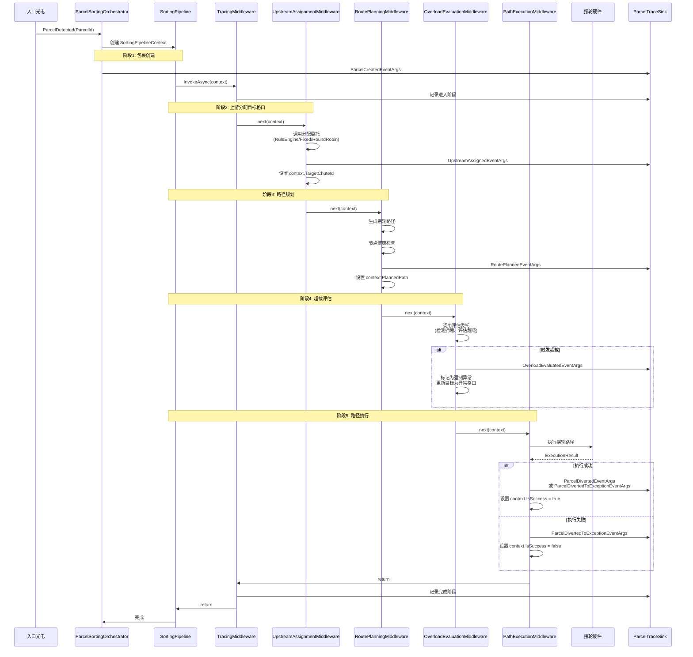

# 分拣流水线序列图

## 概述

本文档描述包裹从入口光电检测到最终落格的完整流程，以及各个阶段的事件和中间件。

## 整体流水线架构

分拣流水线采用中间件模式，将整个分拣过程分解为多个独立的、可组合的处理阶段。每个阶段由一个中间件负责，中间件之间通过 `SortingPipelineContext` 传递状态和数据。

### 核心组件

- **SortingPipelineContext**: 包裹在流水线中的上下文对象，包含包裹ID、目标格口、路径、状态等信息
- **ISortingPipelineMiddleware**: 中间件接口，定义了 `InvokeAsync` 方法
- **SortingPipeline**: 流水线执行器，按顺序执行已注册的中间件

## 分拣流程序列图



## 事件类型详解

### 1. ParcelCreatedEventArgs
**触发时机**: 入口光电检测到包裹时
**包含信息**:
- ParcelId: 包裹唯一标识符
- Barcode: 包裹条码（可选）
- CreatedAt: 创建时间
- SensorId: 传感器编号

### 2. UpstreamAssignedEventArgs
**触发时机**: 上游系统分配目标格口时
**包含信息**:
- ParcelId: 包裹唯一标识符
- ChuteId: 分配的目标格口ID
- AssignedAt: 分配时间
- LatencyMs: 分配耗时
- Status: 分配状态（Success/Timeout/Error）
- Source: 分配来源（Upstream/Fixed/RoundRobin）

### 3. RoutePlannedEventArgs
**触发时机**: 路径规划完成时
**包含信息**:
- ParcelId: 包裹唯一标识符
- TargetChuteId: 目标格口ID
- PlannedAt: 规划时间
- SegmentCount: 路径段数量
- EstimatedTimeMs: 预估执行时间
- IsHealthy: 路径是否健康
- UnhealthyNodes: 不健康的节点列表

### 4. OverloadEvaluatedEventArgs
**触发时机**: 超载策略评估包裹时
**包含信息**:
- ParcelId: 包裹唯一标识符
- EvaluatedAt: 评估时间
- Stage: 评估阶段（Entry/RoutePlanning）
- CongestionLevel: 当前拥堵等级
- ShouldForceException: 是否强制发送到异常口
- ShouldMarkAsOverflow: 是否标记为潜在超载风险
- Reason: 决策原因
- RemainingTtlMs: 剩余TTL
- InFlightParcels: 在途包裹数

### 5. EjectPlannedEventArgs / EjectIssuedEventArgs
**触发时机**: 规划或发出吐件指令时
**包含信息**:
- ParcelId: 包裹唯一标识符
- NodeId: 摆轮节点ID
- Direction: 吐件方向
- TargetChuteId: 目标格口ID

### 6. ParcelDivertedEventArgs
**触发时机**: 包裹成功分拣到目标格口时
**包含信息**:
- ParcelId: 包裹唯一标识符
- DivertedAt: 落格时间
- ActualChuteId: 实际到达的格口ID
- TargetChuteId: 目标格口ID
- TotalTimeMs: 分拣总耗时
- IsSuccess: 是否成功

### 7. ParcelDivertedToExceptionEventArgs
**触发时机**: 包裹被发送到异常格口时
**包含信息**:
- ParcelId: 包裹唯一标识符
- DivertedAt: 落格时间
- ExceptionChuteId: 异常格口ID
- Reason: 异常原因
- OriginalTargetChuteId: 原始目标格口ID
- ExceptionType: 异常类型
- TotalTimeMs: 分拣总耗时

## 中间件详解

### TracingMiddleware
**职责**: 在流水线的关键节点记录追踪日志
**位置**: 包裹状态变化的前后
**输出**: ParcelTraceEventArgs (通用追踪事件)

### UpstreamAssignmentMiddleware
**职责**: 从上游系统获取目标格口
**依赖**: UpstreamAssignmentDelegate (由Host层提供实现)
**输出**: UpstreamAssignedEventArgs
**关键逻辑**:
- 根据分拣模式（Formal/FixedChute/RoundRobin）调用相应的分配逻辑
- 处理超时和错误情况
- 设置 context.TargetChuteId

### RoutePlanningMiddleware
**职责**: 生成摆轮路径
**依赖**: ISwitchingPathGenerator, PathHealthChecker
**输出**: RoutePlannedEventArgs
**关键逻辑**:
- 根据目标格口生成摆轮路径
- 执行节点健康检查
- 处理路径生成失败的情况
- 设置 context.PlannedPath

### OverloadEvaluationMiddleware
**职责**: 评估包裹是否需要超载处理
**依赖**: OverloadEvaluationDelegate (由Host层提供实现)
**输出**: OverloadEvaluatedEventArgs
**关键逻辑**:
- 入口阶段超载检查
- 路径规划阶段超载检查
- 根据拥堵等级和策略决策是否强制发送到异常口
- 设置 context.ShouldForceException 和 ExceptionReason

### PathExecutionMiddleware
**职责**: 执行摆轮路径
**依赖**: ISwitchingPathExecutor, IPathFailureHandler
**输出**: ParcelDivertedEventArgs 或 ParcelDivertedToExceptionEventArgs
**关键逻辑**:
- 调用 ISwitchingPathExecutor 执行路径
- 处理执行成功和失败的情况
- 调用失败处理器（如果执行失败）
- 设置 context.IsSuccess 和 ActualChuteId

## 扩展流水线

### 添加新的中间件

1. **创建中间件类**，实现 `ISortingPipelineMiddleware` 接口：

```csharp
public class CustomMiddleware : ISortingPipelineMiddleware
{
    public async ValueTask InvokeAsync(
        SortingPipelineContext context, 
        Func<SortingPipelineContext, ValueTask> next)
    {
        // 前置逻辑
        // 检查、修改上下文
        
        // 调用下一个中间件
        await next(context);
        
        // 后置逻辑
        // 清理、记录
    }
}
```

2. **注册中间件**到流水线：

```csharp
var pipeline = new SortingPipeline(logger);
pipeline
    .Use(tracingMiddleware)
    .Use(upstreamMiddleware)
    .Use(customMiddleware)  // 新增的中间件
    .Use(routePlanningMiddleware)
    .Use(overloadMiddleware)
    .Use(executionMiddleware);
```

### 中间件顺序的重要性

中间件的执行顺序决定了数据流和处理逻辑：

1. **TracingMiddleware** - 应该在最外层，记录整个流程
2. **UpstreamAssignmentMiddleware** - 必须在路径规划之前
3. **RoutePlanningMiddleware** - 需要目标格口信息
4. **OverloadEvaluationMiddleware** - 可以在路径规划之后评估
5. **PathExecutionMiddleware** - 必须在最后执行实际的硬件操作

### 短路流水线

如果中间件需要短路流水线（例如早期检测到异常），可以不调用 `next` 直接返回：

```csharp
public async ValueTask InvokeAsync(
    SortingPipelineContext context, 
    Func<SortingPipelineContext, ValueTask> next)
{
    if (ShouldShortCircuit(context))
    {
        context.ShouldForceException = true;
        context.ExceptionReason = "Short circuit reason";
        // 不调用 next，直接返回
        return;
    }
    
    await next(context);
}
```

## 与现有系统的集成

### ParcelSortingOrchestrator

现有的 `ParcelSortingOrchestrator` 可以使用流水线来编排分拣流程：

```csharp
// 创建流水线上下文
var context = new SortingPipelineContext
{
    ParcelId = parcelId,
    Barcode = barcode,
    CreatedAt = DateTimeOffset.UtcNow
};

// 执行流水线
await _pipeline.ExecuteAsync(context);

// 检查结果
if (context.IsSuccess)
{
    // 处理成功
}
else
{
    // 处理失败
}
```

### 委托模式

中间件使用委托模式来保持与具体实现的解耦：

- **UpstreamAssignmentDelegate**: 由Host层实现，封装RuleEngine交互、Fixed模式、RoundRobin模式
- **OverloadEvaluationDelegate**: 由Host层实现，封装拥堵检测、超载策略评估
- **ParcelCompletionDelegate**: 由Host层实现，封装包裹完成的统计和监控

这种设计允许Execution层定义流水线结构，而具体的业务逻辑由Host层提供。

## 总结

通过引入流水线和中间件模式，我们实现了：

1. **清晰的流程可见性**: 包裹处理流程一目了然
2. **模块化**: 每个阶段独立、可测试
3. **可扩展性**: 易于添加新的处理步骤
4. **可追踪性**: 统一的事件发布和追踪机制
5. **灵活性**: 通过委托模式支持不同的实现策略

这使得"包裹从入口到落格"的主链路像管道一样清晰，而不是散落在各个Handler和Service中的碎片。
