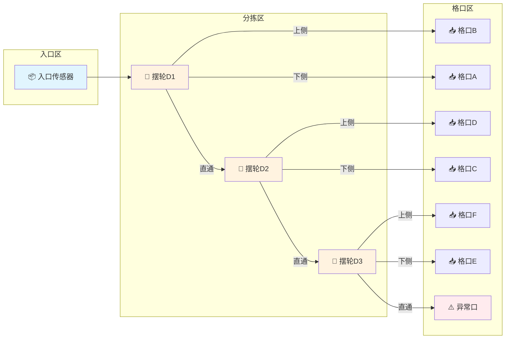

# N 摆轮线性拓扑模型

> **文档版本**: 1.1 (PR-TOPO02)  
> **最后更新**: 2024-12-01  
> **基于代码**: `Core/LineModel/Configuration/Models/ChutePathTopologyConfig.cs`, `Core/LineModel/Topology/DefaultSwitchingPathGenerator.cs`

## 概述

本文档描述摆轮分拣系统的 **N 摆轮线性拓扑模型**，该模型支持 N 个摆轮（N ≥ 1），每个摆轮左右各一个格口，末端一个异常口。

**格口总数公式**: `总格口数 = N × 2 + 1`

## N=3 拓扑结构图（Mermaid）



## ASCII 拓扑图（N=3 平面图）

```
             格口B     格口D     格口F
               ↑         ↑         ↑
入口传感器 → 摆轮D1 → 摆轮D2 → 摆轮D3 → 末端(默认异常口)
     ↓         ↓         ↓         ↓
  创建包裹   格口A      格口C     格口E
```

**说明：**
- 格口分布在摆轮两侧（左侧/右侧，对应配置中的 Left/Right）
- 入口传感器触发包裹创建
- 包裹沿主线直通，在目标摆轮处分拣到对应格口
- 未匹配的包裹直通到末端异常口

## 核心配置模型

### DiverterNodeConfig（简化配置）

```csharp
/// <summary>
/// 简化的摆轮节点配置（PR-TOPO02）
/// </summary>
public readonly record struct DiverterNodeConfig
{
    /// <summary>摆轮索引（从 1 开始）</summary>
    public required int Index { get; init; }
    
    /// <summary>左侧格口ID</summary>
    public required long LeftChuteId { get; init; }
    
    /// <summary>右侧格口ID</summary>
    public required long RightChuteId { get; init; }
}
```

### N=3 配置示例

```csharp
var diverters = new List<DiverterNodeConfig>
{
    new() { Index = 1, LeftChuteId = 1, RightChuteId = 2 },
    new() { Index = 2, LeftChuteId = 3, RightChuteId = 4 },
    new() { Index = 3, LeftChuteId = 5, RightChuteId = 6 }
};

var config = new ChutePathTopologyConfig
{
    TopologyId = "linear-n3",
    TopologyName = "3摆轮线性拓扑",
    EntrySensorId = 1,
    Diverters = diverters,
    DiverterNodes = GenerateNodesFromDiverters(diverters),
    ExceptionChuteId = 999  // 异常口 = AbnormalChuteId
};
```

## 路径生成策略

### 普通格口路径生成

当目标格口不是异常口时：

1. **找到目标摆轮**: 在 `DiverterNodes` 中找到包含目标格口的节点
2. **生成路径段**:
   - **目标节点之前的节点**: `TargetDirection = Straight`（直通）
   - **目标节点**: 根据格口位置设为 `Left` 或 `Right`
   - **目标节点之后的节点**: `TargetDirection = Straight`（包裹已被分走）

### 异常口路径生成

当目标格口是异常口时：

- **所有摆轮**: `TargetDirection = Straight`（全部直通）
- 包裹直接到达末端异常口

### 路径示例

| 目标格口 | D1 方向 | D2 方向 | D3 方向 | 说明 |
|---------|---------|---------|---------|------|
| 格口A (下侧) | Left | Straight | Straight | D1下侧分拣 |
| 格口B (上侧) | Right | Straight | Straight | D1上侧分拣 |
| 格口C (下侧) | Straight | Left | Straight | D1直通，D2下侧分拣 |
| 格口D (上侧) | Straight | Right | Straight | D1直通，D2上侧分拣 |
| 格口E (下侧) | Straight | Straight | Left | D1/D2直通，D3下侧分拣 |
| 格口F (上侧) | Straight | Straight | Right | D1/D2直通，D3上侧分拣 |
| 异常口 | Straight | Straight | Straight | 全部直通 |

## 配置验证规则

`ChutePathTopologyValidator` 执行以下验证：

| 规则 | 说明 |
|------|------|
| 至少一个摆轮 | `Diverters.Count >= 1` |
| 格口数量 | `allChutes.Count == Diverters.Count * 2` |
| 异常口唯一 | `AbnormalChuteId ∉ allChutes` |
| 总格口数 | `totalCount == N × 2 + 1` |
| 格口ID唯一 | 所有格口ID不重复 |
| 索引连续 | 摆轮索引从1开始连续 |

## 不同规模配置对比

| N | 摆轮数 | 普通格口数 | 异常口 | 总格口数 | 路径段数 |
|---|--------|-----------|--------|---------|---------|
| 1 | 1 | 2 | 1 | 3 | 1 |
| 3 | 3 | 6 | 1 | 7 | 3 |
| 4 | 4 | 8 | 1 | 9 | 4 |
| N | N | 2N | 1 | 2N+1 | N |

## 相关文件

- **配置模型**: `Core/LineModel/Configuration/Models/ChutePathTopologyConfig.cs`
- **路径生成**: `Core/LineModel/Topology/DefaultSwitchingPathGenerator.cs`
- **验证器**: `Core/LineModel/Configuration/Models/ChutePathTopologyConfig.cs` (ChutePathTopologyValidator)
- **应用服务**: `Application/Services/Topology/ChutePathTopologyService.cs`

## 测试用例

测试位置: `tests/ZakYip.WheelDiverterSorter.Core.Tests/`

- `ChutePathTopologyConfigTests.cs` - N 摆轮配置验证测试
- `DefaultSwitchingPathGeneratorTests.cs` - N 摆轮路径生成测试

测试覆盖场景:
- N=1: 单摆轮（最小配置）
- N=3: 三摆轮（与 README 原拓扑对齐）
- N=4: 四摆轮（验证线性扩展）

---

**维护团队**: ZakYip Development Team
