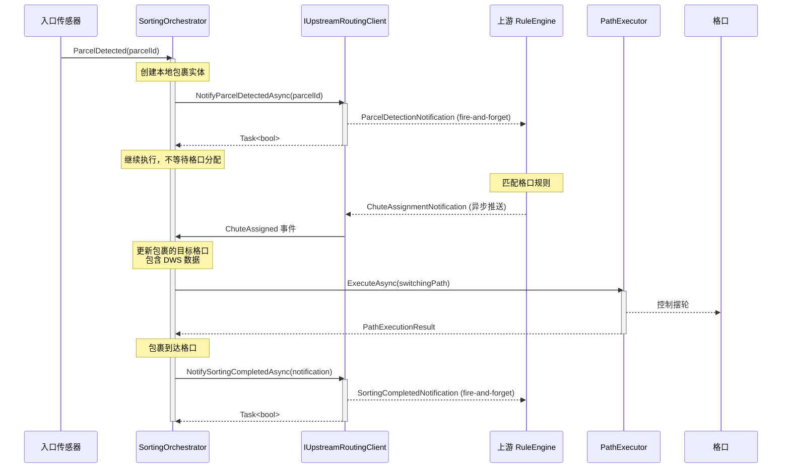

# 上游交互时序图 - Fire-and-Forget 模式

> PR-UPSTREAM02: 本文档描述上游交互的三步模式 - 检测通知 + 异步格口推送 + 落格完成通知

## 交互概述

本系统与上游 RuleEngine 的交互采用 **Fire-and-Forget** 模式，完全异步，不存在同步请求-响应的格口分配机制。

### 交互流程

1. **入口检测时**：向上游发送包裹检测通知（fire-and-forget）
2. **上游推送**：上游系统匹配格口后，主动推送格口分配（包含 DWS 数据）
3. **落格完成时**：向上游发送落格完成通知（fire-and-forget）

## 时序图



## 接口定义

### IUpstreamRoutingClient

```csharp
public interface IUpstreamRoutingClient : IDisposable
{
    bool IsConnected { get; }

    // 格口分配事件（由上游推送触发）
    event EventHandler<ChuteAssignmentEventArgs>? ChuteAssigned;

    Task<bool> ConnectAsync(CancellationToken ct = default);
    Task DisconnectAsync();

    // Fire-and-forget: 包裹检测通知
    Task<bool> NotifyParcelDetectedAsync(long parcelId, CancellationToken ct = default);

    // Fire-and-forget: 落格完成通知
    Task<bool> NotifySortingCompletedAsync(SortingCompletedNotification notification, CancellationToken ct = default);
}
```

### 事件参数

```csharp
// 格口分配事件参数（由上游推送）
public record ChuteAssignmentEventArgs
{
    public required long ParcelId { get; init; }
    public required long ChuteId { get; init; }
    public required DateTimeOffset AssignedAt { get; init; }
    public DwsMeasurement? DwsPayload { get; init; }  // DWS 数据
    public Dictionary<string, string>? Metadata { get; init; }
}

// 落格完成通知
public record SortingCompletedNotification
{
    public required long ParcelId { get; init; }
    public required long ActualChuteId { get; init; }
    public required DateTimeOffset CompletedAt { get; init; }
    public bool IsSuccess { get; init; } = true;
    public string? FailureReason { get; init; }
}

// DWS 测量数据
public readonly record struct DwsMeasurement
{
    public decimal WeightGrams { get; init; }
    public decimal LengthMm { get; init; }
    public decimal WidthMm { get; init; }
    public decimal HeightMm { get; init; }
    public decimal? VolumetricWeightGrams { get; init; }
    public string? Barcode { get; init; }
    public DateTimeOffset MeasuredAt { get; init; }
}
```

## 消息模型

### Communication 层模型

| 模型 | 用途 | 方向 |
|------|------|------|
| `ParcelDetectionNotification` | 包裹检测通知 | 客户端 → 服务器 |
| `ChuteAssignmentNotification` | 格口分配通知 | 服务器 → 客户端 |
| `SortingCompletedNotificationDto` | 落格完成通知 | 客户端 → 服务器 |

### 协议支持

本交互模式支持以下协议：
- **TCP** (`TcpRuleEngineClient`)
- **SignalR** (`SignalRRuleEngineClient`)
- **MQTT** (`MqttRuleEngineClient`)
- **InMemory** (`InMemoryRuleEngineClient` - 用于测试/仿真)

## 关键设计决策

### 1. 移除格口分配请求

**旧模式（已移除）**：
```csharp
// ❌ 不再使用
var response = await client.RequestChuteAssignmentAsync(request);
```

**新模式**：
```csharp
// ✅ 检测通知（fire-and-forget）
await client.NotifyParcelDetectedAsync(parcelId);

// ✅ 通过事件接收格口分配
client.ChuteAssigned += (sender, args) => {
    // 处理格口分配
};
```

### 2. 异步推送 + 本地缓存

包裹检测后立即可以继续执行，不等待格口分配：
- 检测时在 `InMemoryRoutePlanRepository` 中登记"待分配包裹"
- 收到 `ChuteAssigned` 事件时补齐目标格口和 DWS 数据
- 路径生成时从仓库读取映射

### 3. 落格完成通知

无论正常落格还是进入异常口，都会发送完成通知：
```csharp
var notification = new SortingCompletedNotification
{
    ParcelId = parcelId,
    ActualChuteId = result.ActualChuteId,
    CompletedAt = clock.LocalNowOffset,
    IsSuccess = result.IsSuccess,
    FailureReason = result.FailureReason
};
await client.NotifySortingCompletedAsync(notification);
```

## 参与者

| 参与者 | 角色 | 项目位置 |
|--------|------|----------|
| `SortingOrchestrator` | 分拣编排服务 | Execution |
| `IUpstreamRoutingClient` | 上游通信抽象 | Core/Abstractions |
| `TcpRuleEngineClient` | TCP 客户端实现 | Communication/Clients |
| `SignalRRuleEngineClient` | SignalR 客户端实现 | Communication/Clients |
| `MqttRuleEngineClient` | MQTT 客户端实现 | Communication/Clients |
| `InMemoryRuleEngineClient` | 内存客户端（测试） | Communication/Clients |

## 相关 PR

- PR-UPSTREAM02: 实现上游交互重构
- PR-U1: 合并 IRuleEngineClient 到 IUpstreamRoutingClient
