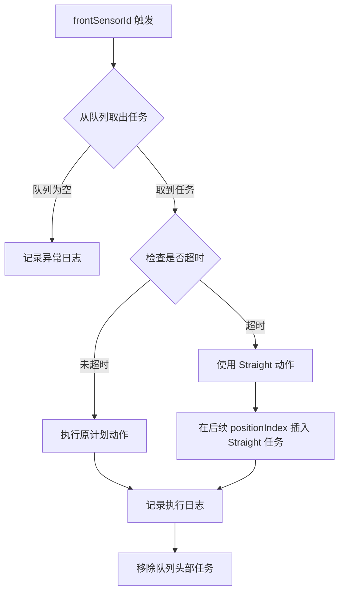

# 包裹丢失检测与处理指南 (Parcel Loss Detection Guide)

> **文档版本**: 1.0  
> **最后更新**: 2025-12-12  
> **适用系统**: ZakYip 摆轮分拣系统

---

## 概述 (Overview)

本文档说明基于 Position-Index 队列系统的包裹丢失检测机制、识别规则和异常处理流程。

---

## 1. 包裹生命周期与检测点

### 1.1 完整生命周期

```
入口传感器触发 → 创建包裹 → 请求路由 → 生成路径 → 任务入队
                                                    ↓
                                      Position 1 队列 (摆轮 D1 任务)
                                                    ↓
                        frontSensorId触发 → 取出任务 → 检查超时 → 执行动作
                                                    ↓
                                      Position 2 队列 (摆轮 D2 任务)
                                                    ↓
                                                  (重复...)
                                                    ↓
                                              落入目标格口
```

### 1.2 关键检测点

| 检测点 | 触发条件 | 检测内容 | 异常处理 |
|--------|---------|---------|---------|
| **入口传感器** | IO 触发 | 包裹到达入口 | 创建包裹、请求路由 |
| **摆轮前传感器** (frontSensorId) | IO 触发 | 包裹到达摆轮前 | 从 positionIndex 队列取任务执行 |
| **超时检测** | 执行动作时 | 当前时间 vs 期望到达时间 | 超时则使用 Straight 动作 |
| **队列状态** | 任何时刻 | 队列中任务是否异常积压 | 告警/清理 |

---

## 2. 超时检测机制

### 2.1 超时判定公式

```
超时判定 = (当前时间 > 期望到达时间 + 超时容差)

其中：
  期望到达时间 = 创建包裹时间 + Σ(前序线段理论传输时间)
  超时容差 = segmentConfiguration.TimeToleranceMs
  理论传输时间 = (segmentLength / segmentSpeed) × 1000  (毫秒)
```

### 2.2 超时检测时机

**重要**: 超时检测仅在 **IO 触发时** 进行，不使用后台轮询。

```csharp
// ✅ 正确：IO 触发时检查超时
public async Task OnFrontSensorTriggered(int positionIndex)
{
    var task = _queueManager.DequeueTaskFromPosition(positionIndex);
    if (task == null) return;
    
    var currentTime = _clock.LocalNow;
    var isTimeout = currentTime > task.ExpectedArrivalTime.AddMilliseconds(task.TimeoutThreshold);
    
    var actionToExecute = isTimeout ? DiverterDirection.Straight : task.DiverterAction;
    await ExecuteDiverterAction(task.DiverterId, actionToExecute);
}
```

### 2.3 超时处理流程



**代码示例：超时处理**

```csharp
if (isTimeout)
{
    _logger.LogWarning(
        "包裹 {ParcelId} 在 Position {Position} 超时，切换为 Straight 动作",
        task.ParcelId, positionIndex);
    
    // 使用回退动作（默认 Straight）
    actionToExecute = task.FallbackAction;
    
    // 在后续所有 positionIndex 插入 Straight 任务（因为超时包裹会比后续包裹先到达）
    InsertStraightTasksForSubsequentPositions(task.ParcelId, positionIndex);
}
```

---

## 3. 包裹丢失识别规则

### 3.1 丢失判定条件

包裹被判定为 **丢失 (Lost)** 的条件：

1. **队列中有任务，但长时间未被触发**
   - 队列头部任务超过 `maxAllowedDelayMs`（默认 10 秒）仍未触发
   - 表示传感器未检测到包裹通过
   
2. **队列为空但触发器被触发**
   - frontSensorId 触发，但对应 positionIndex 队列为空
   - 表示未预期的包裹到达

3. **ConveyorSegment 启用丢失检测**
   - `EnableLossDetection = true`
   - 超时阈值 = 理论传输时间 + TimeToleranceMs

### 3.2 丢失检测实现

**方案 A：被动检测（推荐）**

在 IO 触发时检测队列状态异常：

```csharp
public async Task OnFrontSensorTriggered(int positionIndex)
{
    var task = _queueManager.DequeueTaskFromPosition(positionIndex);
    
    if (task == null)
    {
        // 队列为空但触发器被触发 → 未预期的包裹
        _logger.LogError(
            "Position {Position} 队列为空，但传感器被触发，可能是未预期的包裹或队列管理错误",
            positionIndex);
        
        _metrics.RecordUnexpectedParcelAtPosition(positionIndex);
        return;
    }
    
    // 正常处理...
}
```

**方案 B：主动检测（可选）**

定期扫描队列，检测长时间未触发的任务：

```csharp
public async Task CheckStuckParcelsAsync()
{
    var now = _clock.LocalNow;
    var maxAllowedDelay = TimeSpan.FromSeconds(10);
    
    foreach (var (positionIndex, queue) in _queueManager.GetAllQueues())
    {
        if (queue.TryPeek(out var headTask))
        {
            var delay = now - headTask.ExpectedArrivalTime;
            
            if (delay > maxAllowedDelay)
            {
                _logger.LogWarning(
                    "包裹 {ParcelId} 在 Position {Position} 卡住超过 {Delay}ms，可能已丢失",
                    headTask.ParcelId, positionIndex, delay.TotalMilliseconds);
                
                _metrics.RecordSuspectedLostParcel(headTask.ParcelId, positionIndex);
                
                // 可选：自动清理卡住的任务
                // _queueManager.RemoveTaskFromPosition(positionIndex, headTask.ParcelId);
            }
        }
    }
}
```

---

## 4. 异常场景处理

### 4.1 场景 1：包裹超时但未丢失

**现象**：包裹比预期晚到达，但最终到达

**原因**：
- 线速变化
- 传感器位置偏差
- TimeToleranceMs 设置过小

**处理**：
1. 执行 Straight 动作（避免阻塞后续包裹）
2. 在后续 positionIndex 插入 Straight 任务
3. 记录超时日志
4. 包裹最终路由到异常格口

**建议**：
- 调整 `TimeToleranceMs` 参数
- 校准线速和传感器位置

### 4.2 场景 2：包裹完全丢失

**现象**：队列中有任务，但传感器长时间未触发

**原因**：
- 包裹从传送带掉落
- 传感器故障
- 包裹卡在输送线上

**处理**：
1. 定期扫描检测卡住任务（方案 B）
2. 记录异常日志
3. 告警通知操作员
4. 可选：自动清理卡住任务

**建议**：
- 检查硬件传感器状态
- 检查输送线物理状态
- 启用主动检测（方案 B）

### 4.3 场景 3：队列为空但触发器被触发

**现象**：frontSensorId 触发，但队列为空

**原因**：
- 未通过入口传感器创建包裹（违反 Parcel-First 原则）
- 包裹创建失败但仍进入输送线
- 队列管理错误（任务提前被移除）

**处理**：
1. 记录错误日志
2. 不执行任何动作（摆轮保持当前状态）
3. 告警通知
4. 使用默认 Straight 动作以避免阻塞

**建议**：
- 检查入口传感器是否正常工作
- 检查包裹创建逻辑是否正确
- 审查队列管理代码

### 4.4 场景 4：多包裹并发超时

**现象**：多个包裹同时超时

**原因**：
- 系统突发故障（传感器、网络、硬件）
- 时间配置错误
- 批量包裹延迟

**处理**：
1. 所有超时包裹使用 Straight 动作
2. 批量插入 Straight 任务到后续位置
3. 统计告警（超时率过高）
4. 触发系统健康检查

**建议**：
- 检查系统整体健康状态
- 检查时间配置合理性
- 启用自动恢复机制

---

## 5. 队列状态恢复

### 5.1 面板控制清空队列

**触发条件**：
- 操作员按下 **停止 (Stop)** 按钮
- 操作员按下 **急停 (Emergency Stop)** 按钮
- 操作员按下 **复位 (Reset)** 按钮

**处理流程**：

```csharp
public async Task OnPanelControlEvent(PanelControlEvent eventType)
{
    switch (eventType)
    {
        case PanelControlEvent.Stop:
        case PanelControlEvent.EmergencyStop:
        case PanelControlEvent.Reset:
            _logger.LogWarning("收到面板控制事件 {EventType}，清空所有队列", eventType);
            _queueManager.ClearAllQueues();
            _metrics.RecordQueueCleared(eventType);
            break;
    }
}
```

### 5.2 清空队列实现

```csharp
public void ClearAllQueues()
{
    lock (_lockObject)
    {
        _logger.LogInformation("开始清空所有 positionIndex 队列");
        
        var clearedCount = 0;
        foreach (var (positionIndex, queue) in _queues)
        {
            var count = queue.Count;
            queue.Clear();
            clearedCount += count;
            
            _logger.LogDebug("Position {Position} 队列已清空，移除 {Count} 个任务", 
                positionIndex, count);
        }
        
        _logger.LogInformation("所有队列已清空，总计移除 {Count} 个任务", clearedCount);
    }
}
```

### 5.3 恢复策略

清空队列后：

1. **停止接受新包裹**
   - 禁用入口传感器触发
   - 拒绝上游路由请求
   
2. **等待物理清空**
   - 等待输送线上剩余包裹自然通过
   - 所有包裹使用 Straight 动作（因为队列已空）
   
3. **重新启动**
   - 操作员确认输送线已清空
   - 重新启用入口传感器
   - 系统恢复正常运行

---

## 6. 监控与告警

### 6.1 关键指标

| 指标名称 | 说明 | 告警阈值 | 处理建议 |
|---------|------|---------|---------|
| **队列长度** | 每个 positionIndex 队列中的任务数 | > 10 | 检查输送线速度、传感器响应 |
| **超时率** | 超时任务 / 总任务 | > 5% | 调整 TimeToleranceMs |
| **丢失率** | 丢失包裹 / 总包裹 | > 1% | 检查硬件传感器、输送线 |
| **队列头部等待时间** | 队列头部任务等待时间 | > 10秒 | 检查传感器是否故障 |
| **未预期包裹数** | 队列为空但触发器触发的次数 | > 0 | 检查入口传感器、包裹创建逻辑 |

### 6.2 日志记录

**关键事件日志**：

```csharp
// 包裹创建
_logger.LogInformation("包裹 {ParcelId} 创建于 {Timestamp}，目标格口 {ChuteId}", 
    parcelId, createdAt, targetChuteId);

// 任务入队
_logger.LogDebug("包裹 {ParcelId} 任务已加入 Position {Position} 队列，动作 {Action}",
    parcelId, positionIndex, action);

// 超时检测
_logger.LogWarning("包裹 {ParcelId} 在 Position {Position} 超时 {DelayMs}ms，切换为 Straight",
    parcelId, positionIndex, delayMs);

// 队列为空
_logger.LogError("Position {Position} 队列为空但传感器触发，未预期的包裹",
    positionIndex);

// 队列清空
_logger.LogWarning("收到 {EventType} 事件，清空所有队列，移除 {Count} 个任务",
    eventType, count);
```

### 6.3 告警规则

**立即告警**：
- 队列为空但传感器触发（未预期包裹）
- 队列头部等待时间 > 10秒（疑似丢失）
- 超时率突然升高（> 10%）

**延迟告警**：
- 队列长度持续 > 5（积压）
- 超时率持续 > 5%（配置问题）

---

## 7. 配置建议

### 7.1 TimeToleranceMs 配置

| 场景 | 建议值 | 说明 |
|------|-------|------|
| 高速分拣（> 1.5 m/s） | 200-500ms | 快速响应，严格控制 |
| 标准分拣（1.0-1.5 m/s） | 500-1000ms | 平衡精度与容错（推荐） |
| 低速分拣（< 1.0 m/s） | 1000-2000ms | 更宽松的容错 |

### 7.2 EnableLossDetection 配置

| 场景 | 建议值 | 说明 |
|------|-------|------|
| 生产环境 | `true` | 启用丢失检测，及时发现异常 |
| 测试环境 | `false` | 禁用丢失检测，便于调试 |
| 仿真环境 | `false` | 禁用丢失检测 |

### 7.3 队列监控间隔

| 场景 | 建议值 | 说明 |
|------|-------|------|
| 主动检测（方案 B） | 5-10秒 | 定期扫描队列状态 |
| 被动检测（方案 A） | 不适用 | 仅在 IO 触发时检测 |

---

## 8. 故障排查流程

### 8.1 包裹超时

**症状**：日志显示超时警告

**排查步骤**：
1. 检查 `TimeToleranceMs` 配置是否合理
2. 检查线速 `SpeedMmps` 是否准确
3. 检查线段长度 `LengthMm` 是否准确
4. 检查传感器位置是否准确
5. 检查网络延迟（如果使用上游路由）

**解决方法**：
- 增大 `TimeToleranceMs`
- 校准线速和长度参数
- 调整传感器位置

### 8.2 包裹丢失

**症状**：队列中有任务，但传感器长时间未触发

**排查步骤**：
1. 检查传感器是否正常工作（硬件测试）
2. 检查传感器 IO 连接
3. 检查输送线是否卡住
4. 检查包裹是否掉落

**解决方法**：
- 修复传感器硬件
- 检修输送线
- 手动清理卡住任务

### 8.3 未预期包裹

**症状**：队列为空但传感器触发

**排查步骤**：
1. 检查入口传感器是否正常工作
2. 检查包裹创建逻辑是否正确
3. 检查队列管理逻辑是否有 bug
4. 检查是否有手动放置包裹

**解决方法**：
- 修复入口传感器
- 审查包裹创建代码
- 审查队列管理代码
- 禁止手动放置包裹

---

## 9. 相关文档

- [上游连接配置指南](./UPSTREAM_CONNECTION_GUIDE.md) - 上游协议与超时规则
- [系统配置指南](./SYSTEM_CONFIG_GUIDE.md) - 系统时间与配置管理
- [感应IO轮询配置指南](./SENSOR_IO_POLLING_CONFIGURATION.md) - 传感器轮询参数
- [拓扑配置指南](../TOPOLOGY_LINEAR_N_DIVERTERS.md) - N 摆轮线性拓扑模型

---

## 附录 A：核心数据结构

### PositionQueueItem

```csharp
public record class PositionQueueItem
{
    /// <summary>
    /// 包裹ID
    /// </summary>
    public required string ParcelId { get; init; }
    
    /// <summary>
    /// 摆轮ID
    /// </summary>
    public required long DiverterId { get; init; }
    
    /// <summary>
    /// 摆轮动作（Left/Right/Straight）
    /// </summary>
    public required DiverterDirection DiverterAction { get; init; }
    
    /// <summary>
    /// 期望到达时间
    /// </summary>
    public required DateTime ExpectedArrivalTime { get; init; }
    
    /// <summary>
    /// 超时阈值（毫秒）
    /// </summary>
    public required long TimeoutThreshold { get; init; }
    
    /// <summary>
    /// 异常回退动作（默认 Straight）
    /// </summary>
    public DiverterDirection FallbackAction { get; init; } = DiverterDirection.Straight;
    
    /// <summary>
    /// 任务创建时间
    /// </summary>
    public DateTime CreatedAt { get; init; }
}
```

---

**维护团队**: ZakYip Development Team  
**联系方式**: 请通过 GitHub Issues 报告问题
