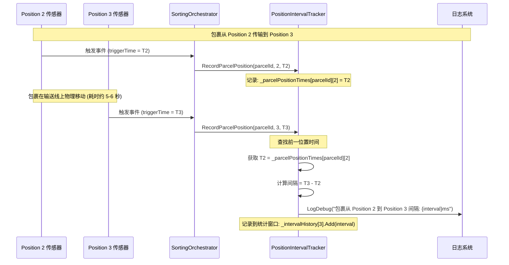

# Position 间隔时间计算详解 (Position Interval Calculation Guide)

> **文档版本**: 1.0  
> **创建日期**: 2025-12-28  
> **适用系统**: ZakYip 摆轮分拣系统

---

## 概述

本文档详细讲解包裹在输送线上从一个 Position 到下一个 Position 的时间是如何计算的，以 **Position 2 到 Position 3** 为例进行深入说明。

### 核心原理

Position 间隔时间反映的是：
- ✅ **包裹在输送线上的物理传输时间**
- ✅ **传感器实际触发时间差**（后一个传感器触发时间 - 前一个传感器触发时间）
- ❌ **不是**系统代码处理耗时
- ❌ **不是**业务逻辑执行时间

---

## 1. Position 概念说明

### 1.1 Position 索引映射

在摆轮分拣系统中，每个物理位置对应一个 Position 索引：

```
Position 0: 入口传感器（包裹创建点）
Position 1: 第 1 个摆轮的前端传感器
Position 2: 第 2 个摆轮的前端传感器
Position 3: 第 3 个摆轮的前端传感器
...
Position N: 第 N 个摆轮的前端传感器
```

### 1.2 包裹传输流程示意图

```
┌──────────┐     ┌──────────┐     ┌──────────┐     ┌──────────┐
│ Position 0│────→│Position 1│────→│Position 2│────→│Position 3│
│  入口传感器│     │  摆轮1前端│     │  摆轮2前端│     │  摆轮3前端│
└──────────┘     └──────────┘     └──────────┘     └──────────┘
     T0              T1              T2              T3
     
间隔计算：
  Position 1 间隔 = T1 - T0
  Position 2 间隔 = T2 - T1  
  Position 3 间隔 = T3 - T2  ← 本文重点讲解
```

---

## 2. Position 2 到 Position 3 时间计算流程

### 2.1 完整流程图



### 2.2 关键步骤详解

#### 步骤 1: Position 2 传感器触发

当包裹到达 Position 2 时：

```csharp
// SortingOrchestrator.cs - HandleWheelFrontSensorAsync()
private async Task HandleWheelFrontSensorAsync(
    long sensorId, 
    long boundWheelDiverterId, 
    int positionIndex,  // = 2
    DateTimeOffset triggerTime)  // = 传感器实际触发时间 T2
{
    // ... 省略其他逻辑 ...
    
    // 记录包裹到达 Position 2
    _intervalTracker?.RecordParcelPosition(
        parcelId, 
        positionIndex: 2,       // Position 索引
        arrivedAt: triggerTime.LocalDateTime  // T2 = 传感器触发时刻
    );
}
```

**重点**：
- `triggerTime` 是传感器的**实际触发时间**，不是代码开始执行的时间
- 这个时间会被存储到字典 `_parcelPositionTimes[parcelId][2]`

#### 步骤 2: 包裹在输送线上移动

包裹离开 Position 2，在输送线上物理移动到 Position 3。这个过程：
- 完全是物理传输过程
- 耗时取决于输送线速度和两个位置之间的距离
- 系统在此期间不做任何计算

#### 步骤 3: Position 3 传感器触发并计算间隔

当包裹到达 Position 3 时：

```csharp
// SortingOrchestrator.cs - HandleWheelFrontSensorAsync()
private async Task HandleWheelFrontSensorAsync(
    long sensorId, 
    long boundWheelDiverterId, 
    int positionIndex,  // = 3
    DateTimeOffset triggerTime)  // = 传感器实际触发时间 T3
{
    // ... 省略其他逻辑 ...
    
    // 记录包裹到达 Position 3，并自动计算与 Position 2 的间隔
    _intervalTracker?.RecordParcelPosition(
        parcelId, 
        positionIndex: 3,       // Position 索引
        arrivedAt: triggerTime.LocalDateTime  // T3 = 传感器触发时刻
    );
}
```

**在 `RecordParcelPosition` 内部**：

```csharp
// PositionIntervalTracker.cs - RecordParcelPosition()
public void RecordParcelPosition(long parcelId, int positionIndex, DateTime arrivedAt)
{
    // 1. 获取或创建该包裹的位置时间记录
    var positionTimes = _parcelPositionTimes.GetOrAdd(
        parcelId,
        _ => new ConcurrentDictionary<int, DateTime>());
    
    // 2. 记录当前位置的到达时间
    positionTimes[positionIndex] = arrivedAt;  // positionTimes[3] = T3
    
    // 3. 如果不是入口位置，计算与前一个 position 的间隔
    if (positionIndex > 0)  // 3 > 0，继续
    {
        int previousPosition = positionIndex - 1;  // previousPosition = 2
        
        // 4. 尝试获取前一个 position 的时间
        if (positionTimes.TryGetValue(previousPosition, out var previousTime))
        {
            // previousTime = T2 (Position 2 的触发时间)
            
            // 5. 计算间隔：T3 - T2
            var intervalMs = (arrivedAt - previousTime).TotalMilliseconds;
            // intervalMs = (T3 - T2).TotalMilliseconds
            
            // 6. 只记录有效的间隔
            if (intervalMs > 0 && intervalMs < _options.MaxReasonableIntervalMs)
            {
                // 记录到统计窗口
                RecordInterval(positionIndex, intervalMs);
                
                // 7. 输出日志
                _logger.LogDebug(
                    "包裹 {ParcelId} 从 Position {PrevPos} 到 Position {CurrPos} 物理运输间隔: {IntervalMs}ms " +
                    "(传感器触发时间差，非处理耗时)",
                    parcelId, previousPosition, positionIndex, intervalMs);
                // 日志示例：包裹 1766891853763 从 Position 2 到 Position 3 物理运输间隔: 5585.1538ms
            }
        }
    }
}
```

---

## 3. 实际计算示例

### 3.1 真实场景时间线

假设一个包裹的传输过程如下：

```
时间         事件                                Position    记录的时间戳
------------------------------------------------------------------------
10:00:00.000 包裹在入口传感器被检测到          Position 0  T0 = 10:00:00.000
10:00:05.692 包裹到达第1个摆轮前端传感器       Position 1  T1 = 10:00:05.692
10:00:11.277 包裹到达第2个摆轮前端传感器       Position 2  T2 = 10:00:11.277
10:00:16.862 包裹到达第3个摆轮前端传感器       Position 3  T3 = 10:00:16.862
```

### 3.2 间隔计算过程

#### Position 1 间隔（Position 0 → Position 1）

```
间隔 = T1 - T0
     = 10:00:05.692 - 10:00:00.000
     = 5692 毫秒
     = 5.692 秒
```

#### Position 2 间隔（Position 1 → Position 2）

```
间隔 = T2 - T1
     = 10:00:11.277 - 10:00:05.692
     = 5585 毫秒
     = 5.585 秒
```

#### Position 3 间隔（Position 2 → Position 3）⭐

```
间隔 = T3 - T2
     = 10:00:16.862 - 10:00:11.277
     = 5585 毫秒
     = 5.585 秒
```

**日志输出**：
```
包裹 1766891853763 从 Position 2 到 Position 3 物理运输间隔: 5585.0ms (传感器触发时间差，非处理耗时)
```

### 3.3 为什么用传感器触发时间而非处理时间？

**场景对比**：

| 时间点 | 传感器触发时间方案 | 处理时间方案 | 差异 |
|-------|------------------|------------|------|
| Position 2 传感器触发 | T2 = 10:00:11.277 | T2 = 10:00:11.277 | 相同 |
| 系统处理 Position 2 事件 | (不影响记录) | - | - |
| Position 3 传感器触发 | T3 = 10:00:16.862 | T3 = 10:00:16.862 | 相同 |
| 系统开始处理 Position 3 事件 | (不影响记录) | T3' = 10:00:16.950 | **+88ms 延迟** |
| 计算间隔 | T3 - T2 = 5585ms | T3' - T2 = 5673ms | **被处理延迟污染** |

**结论**：使用传感器触发时间可以准确反映包裹的物理传输速度，不受系统负载影响。

---

## 4. 代码追踪路径

### 4.1 从传感器触发到间隔计算的完整调用链

```
1. 硬件层：传感器物理触发
   └─> IInputPort.OnInputChanged 事件
   
2. Ingress 层：传感器事件转发
   └─> SensorEventDispatcher.HandleIoEvent()
       └─> 触发 SensorTriggered 事件
   
3. Orchestration 层：包裹处理入口
   └─> SortingOrchestrator.OnSensorTriggered()
       └─> HandleWheelFrontSensorAsync(sensorId, wheelId, positionIndex, triggerTime)
           ├─> triggerTime = args.DetectedAt  ← 传感器实际触发时间
           └─> _intervalTracker?.RecordParcelPosition(parcelId, positionIndex, triggerTime)
   
4. Tracking 层：间隔计算
   └─> PositionIntervalTracker.RecordParcelPosition()
       ├─> 记录当前位置时间: positionTimes[positionIndex] = arrivedAt
       ├─> 获取前一位置时间: positionTimes.TryGetValue(previousPosition, out previousTime)
       ├─> 计算间隔: intervalMs = (arrivedAt - previousTime).TotalMilliseconds
       ├─> 记录到统计窗口: RecordInterval(positionIndex, intervalMs)
       └─> 输出日志
```

### 4.2 关键数据结构

#### 包裹位置时间记录

```csharp
// PositionIntervalTracker.cs
private readonly ConcurrentDictionary<long, ConcurrentDictionary<int, DateTime>> _parcelPositionTimes;

// 数据结构示例：
// {
//   1766891853763: {                    // ParcelId
//     0: 2025-12-28 10:00:00.000,       // Position 0 触发时间
//     1: 2025-12-28 10:00:05.692,       // Position 1 触发时间
//     2: 2025-12-28 10:00:11.277,       // Position 2 触发时间
//     3: 2025-12-28 10:00:16.862        // Position 3 触发时间
//   }
// }
```

#### 间隔统计窗口

```csharp
// PositionIntervalTracker.cs
private readonly ConcurrentDictionary<int, CircularBuffer<double>> _intervalHistory;

// 数据结构示例：
// {
//   1: CircularBuffer([5692, 5700, 5688, ...]),  // Position 1 的最近10次间隔
//   2: CircularBuffer([5585, 5590, 5580, ...]),  // Position 2 的最近10次间隔
//   3: CircularBuffer([5585, 5592, 5578, ...])   // Position 3 的最近10次间隔
// }
```

---

## 5. 统计数据应用

### 5.1 中位数计算

系统会保留每个 Position 的最近 N 次间隔（默认 10 次），并计算中位数：

```csharp
// Position 3 的间隔历史：[5585, 5862, 5525, 5680, 5777, 5573, 5550, 5600, 5620, 5590]
// 排序后：[5525, 5550, 5573, 5585, 5590, 5600, 5620, 5680, 5777, 5862]
// 样本数 = 10（偶数）
// 中位数 = (5590 + 5600) / 2 = 5595 ms
```

### 5.2 统计信息查询

可以通过 API 查询 Position 间隔统计：

```bash
GET /api/sorting/position-intervals

# 响应示例
{
  "success": true,
  "data": [
    {
      "positionIndex": 1,
      "medianIntervalMs": 5692.67,
      "sampleCount": 10,
      "minIntervalMs": 5633.97,
      "maxIntervalMs": 6058.81,
      "lastUpdatedAt": "2025-12-28T10:30:00"
    },
    {
      "positionIndex": 2,
      "medianIntervalMs": 5585.45,
      "sampleCount": 10,
      "minIntervalMs": 5500.12,
      "maxIntervalMs": 5700.23,
      "lastUpdatedAt": "2025-12-28T10:30:15"
    },
    {
      "positionIndex": 3,
      "medianIntervalMs": 5595.00,  ← Position 2 → 3 的中位数间隔
      "sampleCount": 10,
      "minIntervalMs": 5525.00,
      "maxIntervalMs": 5862.00,
      "lastUpdatedAt": "2025-12-28T10:30:30"
    }
  ]
}
```

### 5.3 统计数据用途

Position 间隔统计的中位数值**仅用于观测和监控**，不用于分拣逻辑判断：

✅ **用途**：
- 监控输送线运行状态
- 检测异常波动（如设备故障、包裹卡滞）
- 性能分析和优化依据

❌ **不用于**：
- 超时判定（使用 ConveyorSegmentConfiguration 中的配置）
- 包裹丢失检测（使用独立的丢失检测系数）
- 分拣决策

---

## 6. 异常情况处理

### 6.1 前一位置时间缺失

如果系统启动后第一个包裹到达 Position 3，但没有 Position 2 的记录：

```csharp
// PositionIntervalTracker.cs
if (positionTimes.TryGetValue(previousPosition, out var previousTime))
{
    // 成功获取前一位置时间，计算间隔
}
else
{
    // 前一位置时间不存在，跳过间隔计算
    _logger.LogDebug(
        "包裹 {ParcelId} Position {PosIndex}: 未找到前一位置时间，跳过间隔计算",
        parcelId, positionIndex);
}
```

**日志示例**：
```
包裹 1766891853764 Position 3: 未找到前一位置时间，跳过间隔计算
```

### 6.2 间隔值异常

如果计算出的间隔值超过合理范围（默认 60 秒）：

```csharp
if (intervalMs > 0 && intervalMs < _options.MaxReasonableIntervalMs)
{
    RecordInterval(positionIndex, intervalMs);
}
else
{
    _logger.LogWarning(
        "包裹 {ParcelId} 从 Position {PrevPos} 到 Position {CurrPos} 物理运输间隔异常: {IntervalMs}ms",
        parcelId, previousPosition, positionIndex, intervalMs);
}
```

**可能原因**：
- 输送线长时间停止后重启
- 传感器故障导致触发延迟
- 系统时钟异常

---

## 7. 常见问题解答

### Q1: 为什么日志显示的间隔值有时会波动？

**答**：间隔值反映的是真实的物理传输时间，波动是正常现象，可能原因包括：
- 输送线速度微小波动
- 包裹尺寸和重量差异
- 摆轮动作执行时间差异
- 传感器检测精度误差

**正常波动范围**：通常在中位数的 ±10% 以内。

### Q2: 间隔时间是否包含摆轮动作时间？

**答**：**不包含**。间隔时间仅反映包裹从前一个传感器到当前传感器的传输时间。摆轮动作发生在传感器触发之后，不影响间隔计算。

### Q3: 如果系统处理延迟很大，会影响间隔值吗？

**答**：**不会**。间隔计算使用的是传感器的实际触发时间 `DetectedAt`，而不是系统开始处理事件的时间。即使系统负载很高，处理延迟达到数秒，间隔值仍然准确反映包裹的物理传输时间。

### Q4: 间隔值的精度是多少？

**答**：间隔值以毫秒为单位，理论精度取决于：
- 传感器触发精度（通常 < 1ms）
- IO 采集周期（默认 10ms）
- 系统时钟精度（.NET DateTime 精度约 100ns）

实际有效精度约为 **10-20 毫秒**。

### Q5: 为什么要记录 Position 0（入口）的时间？

**答**：记录 Position 0 的时间有两个作用：
1. 作为 Position 1 间隔计算的基准（入口 → 第一个摆轮）
2. 提供包裹进入系统的准确时间戳

如果不记录 Position 0，Position 1 将无法计算间隔。

---

## 8. 相关代码文件

| 文件路径 | 作用 | 关键方法/属性 |
|---------|------|-------------|
| `Execution/Tracking/PositionIntervalTracker.cs` | 间隔追踪实现 | `RecordParcelPosition()`, `RecordInterval()` |
| `Execution/Tracking/IPositionIntervalTracker.cs` | 间隔追踪接口 | 接口定义和注释说明 |
| `Execution/Orchestration/SortingOrchestrator.cs` | 包裹编排逻辑 | `HandleWheelFrontSensorAsync()` |
| `Ingress/Dispatchers/SensorEventDispatcher.cs` | 传感器事件分发 | `HandleIoEvent()` |
| `Host/Controllers/SortingController.cs` | 统计查询 API | `GetPositionIntervals()` |

---

## 9. 相关文档

- [POSITION_INTERVAL_CLARIFICATION.md](../POSITION_INTERVAL_CLARIFICATION.md) - Position 间隔日志含义说明
- [POSITION_INTERVAL_FIX.md](../POSITION_INTERVAL_FIX.md) - Position 间隔追踪修复历史
- [PARCEL_LOSS_DETECTION.md](./PARCEL_LOSS_DETECTION.md) - 包裹丢失检测机制
- [CORE_ROUTING_LOGIC.md](../CORE_ROUTING_LOGIC.md) - 核心路由逻辑

---

## 10. 总结

### 核心要点

1. **计算公式**：
   ```
   Position N 间隔 = Position N 传感器触发时间 - Position (N-1) 传感器触发时间
   ```

2. **数据来源**：
   - 使用传感器**实际触发时间** `DetectedAt`
   - 不使用系统处理时间，确保数据准确性

3. **计算时机**：
   - 在包裹到达当前 Position 时自动计算
   - 与前一个 Position 的时间差

4. **数据用途**：
   - 仅用于观测和监控
   - 不影响分拣逻辑和超时判定

5. **统计方法**：
   - 使用滑动窗口保留最近 N 次间隔
   - 计算中位数抗异常值干扰

### 示例回顾：Position 2 → Position 3

```
Position 2 传感器触发: T2 = 10:00:11.277
Position 3 传感器触发: T3 = 10:00:16.862

间隔 = T3 - T2 = 5585 毫秒

日志：包裹 1766891853763 从 Position 2 到 Position 3 物理运输间隔: 5585.0ms
```

---

**维护团队**: ZakYip Development Team  
**文档维护**: 请确保代码修改时同步更新本文档  
**反馈渠道**: 请通过 GitHub Issues 报告问题或建议
